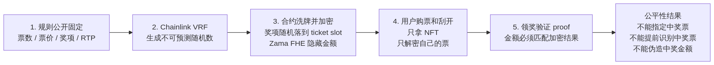

# LuckyScratch

LuckyScratch is a privacy-preserving onchain scratch-card application. It lets creators launch fixed-odds scratch pools, lets players buy NFT tickets with confidential cUSDC, and keeps prize results hidden until the ticket owner scratches and reveals their own ticket.

The core idea is simple: prize rules are public, prize positions are randomized before sales begin, and individual rewards stay encrypted onchain. This prevents creators from steering winning tickets and prevents players from reading the remaining prize distribution before buying.

The implementation combines Solidity contracts, Zama fhEVM encrypted state, Chainlink VRF v2.5 randomness, a Next.js wallet frontend, and a Go/PostgreSQL backend for indexing and reveal orchestration.

## Product Flow

1. A creator configures a scratch pool with ticket count, ticket price, prize tiers, and RTP.
2. Chainlink VRF provides the random seed used to shuffle the fixed prize table into ticket slots.
3. The contract stores each ticket reward as encrypted Zama fhEVM state.
4. A player buys a ticket and receives an ERC-721 ticket NFT.
5. When the player scratches, the app authorizes reveal only for the current ticket owner.
6. The frontend obtains the decrypted amount and proof, then submits a wallet-signed claim transaction.

## What Is In This Repo

- `packages/hardhat`: Solidity contracts, Hardhat config, deployment scripts, TypeChain output, and LuckyScratch contract tests.
- `packages/nextjs`: Next.js App Router frontend with RainbowKit, Wagmi, Viem, Tailwind CSS, DaisyUI, and the LuckyScratch product pages.
- `packages/backend`: Go backend with PostgreSQL migrations, sqlc-generated repositories, chain/indexer services, REST API, IPFS upload support, and Zama reveal proxy orchestration.
- `doc`: product, contract, backend, integration, and deployment notes.
- `AGENTS.md`: repository-specific engineering guidance for coding agents.

## Core Runtime Model

The application keeps final user transactions wallet-driven:

- Pool creation, ticket purchase, scratch, reward claim, creator withdrawal, and bond refund are submitted by the user's wallet.
- The backend does not relay user transactions. It builds read models from indexed events and serves data needed by the frontend.
- Reward values are encrypted onchain with Zama fhEVM primitives. Claiming requires the frontend to obtain a public decryption proof through backend-authorized Zama proxy routes, then submit `claimReward` or `batchClaimRewards`.
- Chainlink VRF v2.5 initializes live-network pool randomness. Local contract tests use the mock fulfillment path.

## Randomness And Fairness

LuckyScratch uses a pre-allocation model instead of drawing a fresh random number when a user buys or scratches. That choice is important: the full prize table is fixed first, then randomized once, then encrypted.



The fairness properties come from four layers:

- **Fixed public rules**: ticket count, ticket price, prize tiers, and RTP are determined at pool creation.
- **Unpredictable shuffle**: Chainlink VRF provides the random seed used by the contract to assign prizes to ticket slots.
- **Encrypted results**: Zama FHE keeps each ticket reward hidden onchain, so users cannot inspect which tickets are still valuable.
- **Proof-based claims**: claiming requires a decrypted amount plus proof, so the claimed clear amount must match the encrypted onchain reward.

This means the creator cannot choose which ticket wins, users cannot identify winning tickets before buying, and claim transactions cannot fake a larger reward.

## Important Paths

- Contracts: `packages/hardhat/contracts/luckyScratch/`
- Deploy script: `packages/hardhat/deploy/02_deploy_lucky_scratch.ts`
- Contract tests: `packages/hardhat/test/luckyScratch/`
- Frontend app routes: `packages/nextjs/app/`
- Frontend LuckyScratch API client: `packages/nextjs/services/luckyScratch/`
- Backend API entrypoint: `packages/backend/main.go`
- Backend SQL migrations: `packages/backend/sql/migrations/`
- Backend SQL queries: `packages/backend/sql/queries/`
- Deployment runbook: `doc/deployment-runbook.md`
- Fairness flowchart: `doc/presentation-flowchart.md`

## Prerequisites

- Node.js `>=20.18.3`
- Yarn `3.2.3` through Corepack or an equivalent Yarn setup
- Go `1.25`
- PostgreSQL for backend API/worker runs
- Docker and Docker Compose for backend container runs
- A working EVM RPC URL for the target chain

## Quick Verification

These commands validate the current codebase without requiring a live deployment:

```bash
yarn install
yarn compile
yarn hardhat:check-types
yarn hardhat:test

cd packages/backend
go test ./...

cd ../..
yarn next:check-types
yarn next:build
```

## Local Development

For contract and frontend development, the most reliable local loop is currently:

```bash
yarn hardhat:test
yarn next:check-types
yarn next:build
```

The backend can run locally when PostgreSQL, an RPC endpoint, and LuckyScratch deployment artifacts for the configured `CHAIN_NAME` are present.

Current local deployment caveat: `packages/hardhat/deploy/02_deploy_lucky_scratch.ts` is configured for real `mainnet` and `sepolia` cUSDC plus Chainlink VRF settings. It does not currently provide a complete localhost deployment path with `TestConfidentialUSDC` and mock VRF. Do not assume plain `yarn deploy --network localhost` is a working full-stack local setup until that deploy path is added.

See `doc/deployment-runbook.md` for the local backend/frontend startup sequence and the exact production deployment flow.

## Environment Files

Templates live here:

- `packages/hardhat/.env.example`
- `packages/backend/.env.example`
- `packages/backend/.env.docker.example`
- `packages/nextjs/.env.example`

Key runtime variables:

- Backend: `DATABASE_URL`, `RPC_URL`, `CHAIN_ID`, `CHAIN_NAME`, `API_PUBLIC_BASE_URL`, `CORS_ALLOWED_ORIGINS`, `ADMIN_TOKEN`
- Backend IPFS: `IPFS_PROVIDER`, `IPFS_PINATA_JWT`, `IPFS_GATEWAY_BASE_URL`
- Backend Zama: Sepolia defaults are built in when `CHAIN_ID=11155111`; override only for non-default relayer/protocol settings.
- Frontend: `NEXT_PUBLIC_BACKEND_URL`, `NEXT_PUBLIC_IPFS_GATEWAY_BASE_URL`, `NEXT_PUBLIC_SEPOLIA_RPC_URL`
- Hardhat live deploy: `ALCHEMY_API_KEY`, `ETHERSCAN_V2_API_KEY`, `DEPLOYER_PRIVATE_KEY_ENCRYPTED`, `CHAINLINK_VRF_SUBSCRIPTION_ID_<NETWORK>`

## Common Commands

```bash
# Contracts
yarn compile
yarn hardhat:check-types
yarn hardhat:test
yarn deploy --network sepolia
LUCKY_SCRATCH_REUSE_EXISTING=true yarn deploy --network sepolia
yarn verify --network sepolia

# Frontend
yarn start
yarn next:check-types
yarn next:build
yarn vercel:yolo --prod

# Backend
cd packages/backend
go test ./...
go run .
go run . api
go run . worker
docker compose up -d
./update-containers.sh
psql "$DATABASE_URL" -v ON_ERROR_STOP=1 -f sql/clean_database.sql
```

## Production Notes

- LuckyScratch live deploys are fresh redeploys by default. Set `LUCKY_SCRATCH_REUSE_EXISTING=true` only when intentionally keeping the previous contract addresses.
- Mainnet full redeploys require `LUCKY_SCRATCH_FORCE_MAINNET_REDEPLOY=true`.
- After each fresh live deploy, add the new `LuckyScratchVRFAdapter` address as a Chainlink VRF subscription consumer before creating pools.
- After a full live redeploy, stop backend API/worker and run `packages/backend/sql/clean_database.sql` if old indexed `pool_id` or `ticket_id` rows would collide with the new contract state.
- Deploy the backend with a real PostgreSQL database and a public `API_PUBLIC_BASE_URL` when reveal-auth must emit externally reachable Zama proxy URLs.

## More Documentation

- `doc/deployment-runbook.md`: local and production deployment operations.
- `doc/presentation-flowchart.md`: fairness and randomness flowchart, with SVG and PNG exports.
- `doc/smart-contract-design.md`: contract design.
- `doc/smart-contract-implementation-plan.md`: contract implementation plan.
- `doc/backend-design.md`: backend architecture.
- `doc/backend-codegen-plan.md`: backend code generation and SQL guidance.
- `doc/frontend-backend-contract-integration-plan.md`: cross-layer integration plan.
