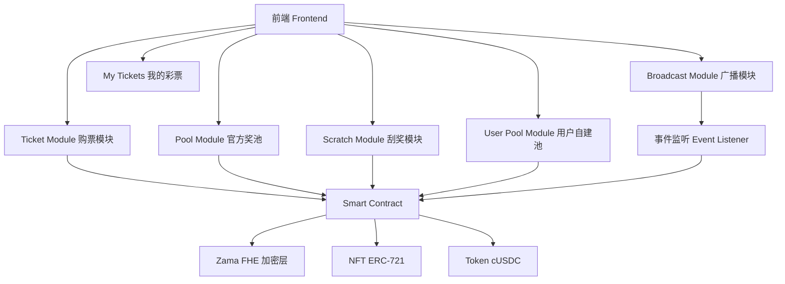
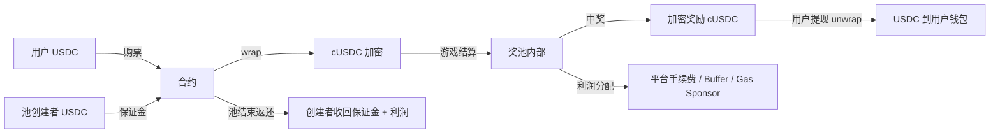
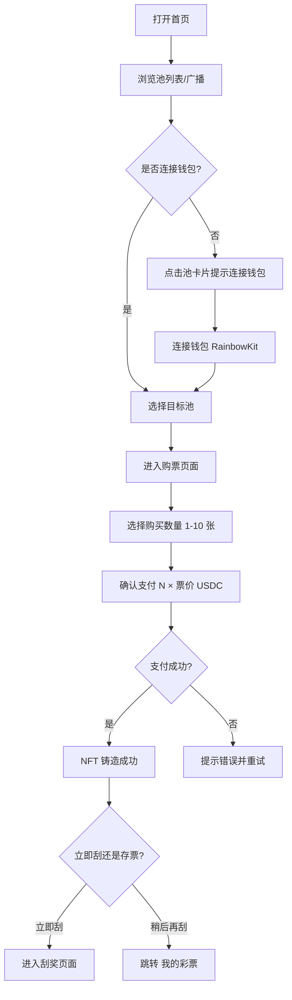
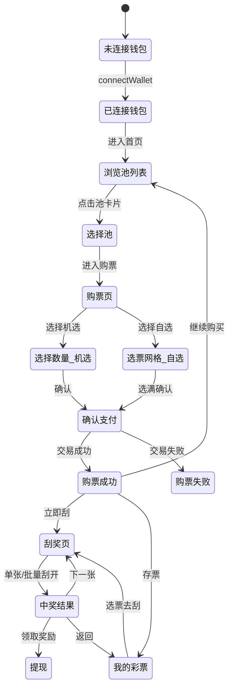

# LuckyScratch — 详细功能设计文档

## A Confidential Scratch Lottery on Zama

> 版本：v3.0 — 详细功能设计（面向 UI 设计 & 开发）
> 更新日期：2026-04-09
> 基础设计参考：[doc/design.md](./design.md)

---

# 目录

1. [项目概述](#1-项目概述)
2. [核心设计理念](#2-核心设计理念)
3. [系统架构](#3-系统架构)
4. [官方奖池系统设计（8 池详设）](#4-官方奖池系统设计8-池详设)
5. [用户自建奖池系统](#5-用户自建奖池系统)
6. [隐私设计（Zama FHE）](#6-隐私设计zama-fhe)
7. [NFT 彩票设计](#7-nft-彩票设计)
8. [Token 与资金流设计](#8-token-与资金流设计)
9. [中奖效果与动效系统](#9-中奖效果与动效系统)
10. [中奖广播系统](#10-中奖广播系统)
11. [收益分配模型](#11-收益分配模型)
12. [Gasless 设计](#12-gasless-设计)
13. [风控系统](#13-风控系统)
14. [用户流程详细设计](#14-用户流程详细设计)
15. [页面设计详细规范](#15-页面设计详细规范)
16. [交互状态机与逻辑规范](#16-交互状态机与逻辑规范)
17. [核心优势](#17-核心优势)
18. [二期功能规划](#18-二期功能规划)

---

# 1. 项目概述

## 1.1 项目定位

LuckyScratch 是一个基于 **Zama FHE（全同态加密）** 构建的隐私刮刮乐彩票系统，部署在公开区块链上，实现：

> 🎯 在"完全公开的链上环境"中，构建一个"不可博弈、不可推断、可持续"的彩票系统

## 1.2 核心问题

传统链上彩票的问题：

- ❌ 奖池透明 → 用户可推断是否值得购买
- ❌ 大奖被抽走 → 用户停止参与
- ❌ 资金流公开 → 套利与博弈行为严重

## 1.3 解决方案

LuckyScratch 通过：

- 🔐 加密奖池状态（FHE）
- 🎲 预分配奖项
- 🧱 多子池并行结构

实现：

> **"用户无法判断奖池状态，从而无法博弈"的系统**

## 1.4 产品定位关键词

链上刮刮乐 · 隐私彩票 · FHE 加密 · 不可篡改 · 可验证公正 · 用户自建池 · 彩票发行权下放

---

# 2. 核心设计理念

## 2.1 不可博弈（Non-Gameable）

用户无法得知：

- 是否已出大奖
- 剩余奖项结构
- 当前奖池价值

👉 消除策略行为

## 2.2 确定性盈利（Deterministic Profitability）

- 每个奖池预分配奖项
- RTP 固定
- 数学上保证长期盈利

## 2.3 多池分散（Multi-Pool Parallelism）

- 不依赖单一奖池
- 多个子池同时运行
- 风险分散

## 2.4 隐私优先（Privacy-first）

所有敏感数据：

- 奖池余额
- 奖项库存
- 用户奖励

👉 均为加密状态

---

# 3. 系统架构

## 3.1 模块结构

系统主链路：

```text
Frontend (Next.js + DaisyUI)
  ↓
Relayer（Gas 代付）
  ↓
Smart Contract（Solidity + Zama FHE）
  ↓
区块链（Sepolia / 目标链）
```

核心模块：



## 3.2 技术栈

| 层 | 技术 |
| --- | --- |
| 前端 | Next.js (App Router) + TypeScript + DaisyUI + Tailwind CSS |
| 合约 | Solidity + Zama FHE (@fhevm/solidity) |
| 钱包 | RainbowKit + Wagmi + Viem |
| 加密 | Zama fhEVM（全同态加密） |
| NFT | ERC-721 |
| Gasless | Relayer 中继 |

---

# 4. 官方奖池系统设计（8 池详设）

## 4.1 池分组逻辑

8 个池分为 **两组**，每组 4 个池，覆盖 4 个价格档位（2U / 5U / 10U / 15U）：

| 分组 | 定位 | 中奖率 | 大奖率 | 用户体验 |
| --- | --- | --- | --- | --- |
| **A 组 — 高中奖率组** | 小奖频出，体验感强 | 高 (60-70%) | 低 (1-2%) | 经常中小奖，刮起来"有感觉" |
| **B 组 — 高大奖组** | 搏大奖，刺激感强 | 低 (25-35%) | 高 (5-8%) | 大多不中，但一中就是大的 |

## 4.2 八池主题命名 & 视觉定义

### A 组 — 高中奖率系列

| 池编号 | 主题名 | 英文名 | 票价 | 视觉主题 | 主色调 | 图标/装饰 |
| --- | --- | --- | --- | --- | --- | --- |
| A1 | 🏮 **鸿运当头** | Lucky Fortune | 2U | 中国红 / 金色祥云 | `#C62828` 正红 + `#FFD700` 金 | 红灯笼、祥云纹、金元宝 |
| A2 | 🌈 **彩虹宝藏** | Rainbow Treasure | 5U | 彩虹渐变 / 宝石 | 多色渐变 `#FF6B6B→#4ECDC4→#45B7D1→#FDBB2D` | 彩虹拱门、宝石、水晶 |
| A3 | 🌸 **樱花物语** | Sakura Story | 10U | 粉色樱花 / 日系清新 | `#FFB7C5` 樱粉 + `#FFF5F5` 浅粉 | 樱花花瓣飘落、和风元素 |
| A4 | ⭐ **星光满溢** | Starlight Overflow | 15U | 深蓝星空 / 银河 | `#1A237E` 深蓝 + `#E8EAF6` 星光银 | 流星、星座图案、银河背景 |

### B 组 — 高大奖率系列

| 池编号 | 主题名 | 英文名 | 票价 | 视觉主题 | 主色调 | 图标/装饰 |
| --- | --- | --- | --- | --- | --- | --- |
| B1 | 🐉 **龙腾万里** | Dragon Rise | 2U | 东方龙纹 / 古典金 | `#B8860B` 暗金 + `#1B1B1B` 深黑 | 金龙腾飞、火焰、古典纹样 |
| B2 | 💎 **钻石猎人** | Diamond Hunter | 5U | 钻石切面 / 冰蓝 | `#00BCD4` 冰蓝 + `#E0F7FA` 浅冰 | 钻石切面光效、闪耀光点 |
| B3 | 🔥 **黄金传奇** | Golden Legend | 10U | 奢华金 / 皇冠 | `#FFD700` 金 + `#212121` 黑金 | 皇冠、金条、闪光特效 |
| B4 | 🌌 **宇宙大奖** | Cosmic Jackpot | 15U | 太空 / 紫色星云 | `#6A1B9A` 宇宙紫 + `#E1BEE7` 星云粉 | 行星、火箭、星云背景 |

## 4.3 池参数详细设计

### A 组：高中奖率池（小奖频出）

#### A1 — 鸿运当头（2U 票价）

| 参数 | 数值 |
| --- | --- |
| 单池规模 | 100 USDC |
| 单张票价 | 2 USDC |
| 单池总票数 | 56 张 |
| 单池总销售额 | 112 USDC |
| 目标 RTP | 89.3% |
| 单池利润 | 12 USDC |
| 中奖率 | 66.1%（37/56 张有奖） |
| 大奖率 | 1.8%（1/56 张为大奖） |
| 子池数量 | 10 |

**奖项分配表：**

| 奖项金额 | 数量 | 小计 | 占比 |
| --- | --- | --- | --- |
| 20U（大奖） | 1 | 20U | 1.8% |
| 10U | 2 | 20U | 3.6% |
| 5U | 4 | 20U | 7.1% |
| 2U（回本奖） | 10 | 20U | 17.9% |
| 1U | 20 | 20U | 35.7% |
| 0U（未中奖） | 19 | 0U | 33.9% |
| **合计** | **56** | **100U** | **100%** |

---

#### A2 — 彩虹宝藏（5U 票价）

| 参数 | 数值 |
| --- | --- |
| 单池规模 | 250 USDC |
| 单张票价 | 5 USDC |
| 单池总票数 | 58 张 |
| 单池总销售额 | 290 USDC |
| 目标 RTP | 86.2% |
| 单池利润 | 40 USDC |
| 中奖率 | 62.1%（36/58 张有奖） |
| 大奖率 | 1.7%（1/58 张为大奖） |
| 子池数量 | 5 |

**奖项分配表：**

| 奖项金额 | 数量 | 小计 | 占比 |
| --- | --- | --- | --- |
| 50U（大奖） | 1 | 50U | 1.7% |
| 25U | 2 | 50U | 3.4% |
| 10U | 5 | 50U | 8.6% |
| 5U（回本奖） | 8 | 40U | 13.8% |
| 2U | 20 | 40U | 34.5% |
| 0U（未中奖） | 22 | 0U | 37.9% |
| **合计** | **58** | **250U** | **100%** |

---

#### A3 — 樱花物语（10U 票价）

| 参数 | 数值 |
| --- | --- |
| 单池规模 | 500 USDC |
| 单张票价 | 10 USDC |
| 单池总票数 | 59 张 |
| 单池总销售额 | 590 USDC |
| 目标 RTP | 84.7% |
| 单池利润 | 90 USDC |
| 中奖率 | 64.4%（38/59 张有奖） |
| 大奖率 | 1.7%（1/59 张为大奖） |
| 子池数量 | 3 |

**奖项分配表：**

| 奖项金额 | 数量 | 小计 | 占比 |
| --- | --- | --- | --- |
| 100U（大奖） | 1 | 100U | 1.7% |
| 50U | 2 | 100U | 3.4% |
| 20U | 5 | 100U | 8.5% |
| 10U（回本奖） | 10 | 100U | 16.9% |
| 5U | 20 | 100U | 33.9% |
| 0U（未中奖） | 21 | 0U | 35.6% |
| **合计** | **59** | **500U** | **100%** |

---

#### A4 — 星光满溢（15U 票价）

| 参数 | 数值 |
| --- | --- |
| 单池规模 | 750 USDC |
| 单张票价 | 15 USDC |
| 单池总票数 | 60 张 |
| 单池总销售额 | 900 USDC |
| 目标 RTP | 83.3% |
| 单池利润 | 150 USDC |
| 中奖率 | 66.7%（40/60 张有奖） |
| 大奖率 | 1.7%（1/60 张为大奖） |
| 子池数量 | 2 |

**奖项分配表：**

| 奖项金额 | 数量 | 小计 | 占比 |
| --- | --- | --- | --- |
| 150U（大奖） | 1 | 150U | 1.7% |
| 75U | 2 | 150U | 3.3% |
| 30U | 5 | 150U | 8.3% |
| 15U（回本奖） | 10 | 150U | 16.7% |
| 5U | 22 | 110U | 36.7% |
| 0U（未中奖） | 20 | 0U | 33.3% |
| **合计** | **60** | **750U** | **100%** |

---

### B 组：高大奖率池（搏大奖）

#### B1 — 龙腾万里（2U 票价）

| 参数 | 数值 |
| --- | --- |
| 单池规模 | 100 USDC |
| 单张票价 | 2 USDC |
| 单池总票数 | 56 张 |
| 单池总销售额 | 112 USDC |
| 目标 RTP | 89.3% |
| 单池利润 | 12 USDC |
| 中奖率 | 30.4%（17/56 张有奖） |
| 大奖率 | 5.4%（3/56 张为 ≥10U 大奖） |
| 子池数量 | 10 |

**奖项分配表：**

| 奖项金额 | 数量 | 小计 | 占比 |
| --- | --- | --- | --- |
| 30U（头奖） | 1 | 30U | 1.8% |
| 15U | 2 | 30U | 3.6% |
| 10U | 4 | 40U | 7.1% |
| 0U（未中奖） | 49 | 0U | 87.5% |
| **合计** | **56** | **100U** | **100%** |

> 特点：大部分票不中，但中就是大奖，单票最大回报 15 倍

---

#### B2 — 钻石猎人（5U 票价）

| 参数 | 数值 |
| --- | --- |
| 单池规模 | 250 USDC |
| 单张票价 | 5 USDC |
| 单池总票数 | 58 张 |
| 单池总销售额 | 290 USDC |
| 目标 RTP | 86.2% |
| 单池利润 | 40 USDC |
| 中奖率 | 27.6%（16/58 张有奖） |
| 大奖率 | 5.2%（3/58 张为 ≥25U 大奖） |
| 子池数量 | 5 |

**奖项分配表：**

| 奖项金额 | 数量 | 小计 | 占比 |
| --- | --- | --- | --- |
| 80U（头奖） | 1 | 80U | 1.7% |
| 40U | 2 | 80U | 3.4% |
| 5U（回本奖） | 6 | 30U | 10.3% |
| 2U | 7 | 14U | 12.1% |
| 0U（未中奖） | 42 | 0U | 72.4% |
| **合计** | **58** | **250U**(含 46U 分散小奖) | **100%** |

> 特点：头奖 80U（16 倍回报），绝大多数无奖

---

#### B3 — 黄金传奇（10U 票价）

| 参数 | 数值 |
| --- | --- |
| 单池规模 | 500 USDC |
| 单张票价 | 10 USDC |
| 单池总票数 | 59 张 |
| 单池总销售额 | 590 USDC |
| 目标 RTP | 84.7% |
| 单池利润 | 90 USDC |
| 中奖率 | 25.4%（15/59 张有奖） |
| 大奖率 | 6.8%（4/59 张为 ≥50U 大奖） |
| 子池数量 | 3 |

**奖项分配表：**

| 奖项金额 | 数量 | 小计 | 占比 |
| --- | --- | --- | --- |
| 200U（头奖） | 1 | 200U | 1.7% |
| 50U | 3 | 150U | 5.1% |
| 10U（回本奖） | 5 | 50U | 8.5% |
| 5U | 6 | 30U | 10.2% |
| 0U（未中奖） | 44 | 0U | 74.6% |
| **合计** | **59** | **500U**(含 70U 打底) | **100%** |

> 特点：头奖 200U（20 倍回报），刺激感极强

---

#### B4 — 宇宙大奖（15U 票价）

| 参数 | 数值 |
| --- | --- |
| 单池规模 | 750 USDC |
| 单张票价 | 15 USDC |
| 单池总票数 | 60 张 |
| 单池总销售额 | 900 USDC |
| 目标 RTP | 83.3% |
| 单池利润 | 150 USDC |
| 中奖率 | 28.3%（17/60 张有奖） |
| 大奖率 | 8.3%（5/60 张为 ≥50U 大奖） |
| 子池数量 | 2 |

**奖项分配表：**

| 奖项金额 | 数量 | 小计 | 占比 |
| --- | --- | --- | --- |
| 300U（头奖） | 1 | 300U | 1.7% |
| 100U | 2 | 200U | 3.3% |
| 50U | 2 | 100U | 3.3% |
| 15U（回本奖） | 5 | 75U | 8.3% |
| 5U | 7 | 35U | 11.7% |
| 0U（未中奖） | 43 | 0U | 71.7% |
| **合计** | **60** | **750U**(含 40U 打底) | **100%** |

> 特点：头奖 300U（20 倍回报），最高倍率池，终极刺激

---

## 4.4 全局 RTP 汇总

| 池名 | 组 | 票价 | RTP | 中奖率 | 大奖率 | 子池数 |
| --- | --- | --- | --- | --- | --- | --- |
| 🏮 鸿运当头 | A | 2U | 89.3% | 66.1% | 1.8% | 10 |
| 🌈 彩虹宝藏 | A | 5U | 86.2% | 62.1% | 1.7% | 5 |
| 🌸 樱花物语 | A | 10U | 84.7% | 64.4% | 1.7% | 3 |
| ⭐ 星光满溢 | A | 15U | 83.3% | 66.7% | 1.7% | 2 |
| 🐉 龙腾万里 | B | 2U | 89.3% | 30.4% | 5.4% | 10 |
| 💎 钻石猎人 | B | 5U | 86.2% | 27.6% | 5.2% | 5 |
| 🔥 黄金传奇 | B | 10U | 84.7% | 25.4% | 6.8% | 3 |
| 🌌 宇宙大奖 | B | 15U | 83.3% | 28.3% | 8.3% | 2 |

## 4.5 池选择 UI — 用户视角标签

池卡片上展示给用户的标签：

- **A 组标签：** `🎯 高中奖率` `常中小奖` `适合新手`
- **B 组标签：** `💥 搏大奖` `高倍回报` `刺激挑战`
- **价格标签：** `2U` `5U` `10U` `15U`
- **剩余票数：** 加密显示（仅显示"有票 / 售罄"状态，不暴露具体数字）

## 4.6 奖池刷新机制

触发条件：

- 该子池所有票都被抽完

资金来源：

- 本池利润
- Buffer

> 🔒 注意：池子剩余票数和中奖情况通过 Zama FHE 加密，链上公开但不可直接读取

---

# 5. 隐私设计（Zama FHE）

## 5.1 加密数据

| 数据 | 加密方式 | 说明 |
| --- | --- | --- |
| 奖池余额 | `euint64` | 每个子池当前剩余的总奖金 |
| 奖项库存 | `euint32[]` | 每个子池各档位的剩余数量 |
| 剩余票数 | `euint32` | 每个子池剩余可购票数 |
| 用户中奖金额 | `euint64` | 仅 NFT 持有人可解密 |
| 用户累计奖励 | `euint64` | 用户名下所有已刮奖励总和 |
| 刮奖结果 | `euint64` | 刮开后写入，仅用户可解密 |

## 5.2 权限控制

| 数据 | 可见性 |
| --- | --- |
| 用户中奖 | 仅用户本人可解密 |
| 奖池状态（余额/库存/剩余票数） | 加密，任何人不可查看 |
| RTP 规则与奖项结构 | 公开 |
| 池是否有票 | 仅公开 Boolean（有票/售罄），不公开具体数量 |
| 子池总票数（初始配置） | 公开 |

权限说明：

- 奖池余额、奖项库存等系统状态始终以加密形式存储和计算。
- 单张彩票的中奖结果仅对当前 NFT 持有人可解密查看。
- 解密在用户前端本地完成，链上与前端之外不公开明文中奖结果。
- 当未刮开的 NFT 发生转移时，对应查看权限也随持有人变更而转移。
- 链上公开信息只暴露规则与交互结果，不暴露具体奖池内部状态。

## 5.3 核心价值

> 用户无法推断"是否值得购买"——消除一切链上博弈

---

# 6. NFT 彩票设计

## 6.1 模型

每张彩票 = ERC721 NFT

NFT 生命周期：


1. 用户选择池类型并支付票价。
2. 合约为该次购票铸造一张 NFT，初始状态为"未刮开"。
3. 在未刮开之前，不锁定具体子池，也不确定中奖结果。
4. 用户发起刮奖后，系统在对应池类型内随机选择子池并执行加密抽奖。
5. 抽奖结果写入加密状态，NFT 状态更新为"已刮开"。
6. 当前 NFT 持有人可在前端本地解密查看结果，并发起提现。

## 6.2 NFT 内容

包含：

- `tokenId`
- `owner`
- `poolId`（所属池编号 A1-B4）
- 状态（未刮 / 已刮 / 已提现 / 已转让）
- `mintTimestamp`
- `transferCount`（转让次数）

说明：

- NFT 本身不直接公开存储中奖金额。
- NFT 的所有权决定该彩票结果的查看权与提现权。
- 未刮开的 NFT 可转让。
- 已刮开的 NFT 不允许继续转让，查看权与提现权固定归刮开后的当前持有人所有。

## 6.2.1 NFT 转让规则

> 🔄 未刮开的彩票 NFT 支持自由转让，转让后新持有人获得刮奖权和查看权。已刮开的彩票不可转让。

### 转让状态转换

| 当前状态 | 允许转让 | 转让后状态 | 说明 |
| --- | --- | --- | --- |
| 已购未刮 | ✅ 可转让 | 已转让（新持有人视角：已购未刮） | NFT 所有权转移，刮奖权、查看权随之转移 |
| 已转让（未刮开） | ✅ 可再次转让 | 已转让 | 支持多次流转，每次转让均更新持有人 |
| 已刮开 | ❌ 不可转让 | — | 刮奖后 NFT 锁定，防止中奖信息泄露后的投机转让 |
| 已提现 | ❌ 不可转让 | — | 已完成生命周期 |

### 转让后刮奖规则

1. **新持有人发起刮奖**：转让后的 NFT 仅允许新持有人（当前 `owner`）发起刮奖操作。
2. **刮奖后不可转让**：一旦新持有人发起刮奖，NFT 立即进入「已刮开」状态，**不可再转让**。
3. **查看权转移**：在未刮开状态下，查看权始终跟随当前 NFT 持有人。原持有人转让后丧失所有权限。
4. **链上权限校验**：合约在 `scratchTicket()` 调用时校验 `msg.sender == ownerOf(tokenId)`，确保只有当前持有人可刮奖。
5. **转让记录上链**：每次转让触发 `TicketTransferred` 事件，记录 `from`、`to`、`tokenId`。

### 转让 UI 入口

- 「我的彩票」页面中，未刮开的彩票卡片显示 **[转让]** 按钮。
- 点击后弹出转让 Modal：
  - 输入目标地址（支持 ENS 解析）
  - 确认转让提示："转让后您将失去该彩票的所有权限，包括刮奖权和查看权"
  - 确认按钮
- 转让成功后 Toast 通知，卡片从列表移除。

## 6.3 NFT 视觉

每张 NFT 的外观根据所属池主题动态生成：

| 池 | NFT 正面装饰 | 刮开区域样式 | 刮开后背景 |
| --- | --- | --- | --- |
| 🏮 鸿运当头 | 大红底 + 金色纹理 + 灯笼图案 | 金色涂层 | 红色烟花绽放 |
| 🌈 彩虹宝藏 | 彩虹渐变底 + 宝石散落 | 银色闪光涂层 | 宝石旋转动画 |
| 🌸 樱花物语 | 粉色底 + 飘落樱花 | 磨砂粉涂层 | 樱花雨动画 |
| ⭐ 星光满溢 | 深蓝星空底 + 闪烁星点 | 星辰涂层 | 流星划过动画 |
| 🐉 龙腾万里 | 暗金底 + 龙纹浮雕 | 古铜涂层 | 金龙飞腾动画 |
| 💎 钻石猎人 | 冰蓝底 + 钻石折射 | 冰晶涂层 | 钻石旋转闪光 |
| 🔥 黄金传奇 | 黑金底 + 闪光粒子 | 黄金涂层 | 金币下落动画 |
| 🌌 宇宙大奖 | 太空紫底 + 星云 | 星云涂层 | 行星爆发动画 |

## 6.4 加密数据存储

NFT 不存储：

- 奖励
- 中奖信息

这些由加密状态管理。

解密与查看流程：

1. 用户持有 NFT 并发起查看请求。
2. 系统校验当前持有人身份。
3. 前端获取该 NFT 对应的加密结果。
4. 由用户前端本地完成解密并展示中奖结果。

---

# 8. Token 与资金流设计

## 8.1 资金流



## 8.2 使用方式

- 游戏内部：cUSDC（隐私）
- 用户提现：USDC
- 池创建者保证金：USDC

## 8.3 资金流说明

| 资金类型 | 来源 | 去向 |
| --- | --- | --- |
| 购票收入 | 购票用户 | 奖池合约 |
| 奖金发放 | 奖池合约 | 中奖用户 |
| 平台手续费 | 每池销售额提取 | 平台钱包 |
| 创建者保证金 | 池创建者 | 合约锁定，池结束后返还 |
| 创建者利润 | 池销售利润 - 平台手续费 | 池创建者 |
| Gas Sponsor | 利润留存 | Relayer |
| Buffer | 利润留存 | 风控储备 |

---

# 9. 中奖广播系统

## 9.1 功能概述

首页顶部设置实时中奖广播滚动栏，展示最新中奖信息，提升平台的可信度和吸引力。

## 9.2 广播数据来源


- 监听链上 `ScratchResult` 事件
- 过滤中奖金额 > 0 的事件
- 提取：用户地址（脱敏）、中奖金额、池名

## 9.3 广播内容格式

```
🎉 0x1a2b...3c4d 在「鸿运当头」中赢得 20 USDC！
💎 0x5e6f...7g8h 在「钻石猎人」中赢得 80 USDC！
🔥 0xab12...cd34 在「黄金传奇」中赢得 200 USDC！恭喜！
```

## 9.4 广播 UI 规范

| 属性 | 规范 |
| --- | --- |
| 位置 | 首页顶部，Logo 下方，固定可见区域 |
| 样式 | 横向滚动/轮播，每条 3-5 秒自动切换 |
| 背景 | 半透明深色玻璃拟态 + 金色/绿色光效边框 |
| 文字 | 白色主体 + 金色高亮金额 + Emoji 前缀 |
| 动画 | 从右向左平滑滚动，或垂直上滑轮播 |
| 中奖音效 | 大奖（≥50U）播放特殊音效（可选） |
| 空状态 | 若暂无中奖记录，显示"等待幸运儿诞生…" |

## 9.5 隐私保护

- 用户地址仅展示前 4 位 + 后 4 位
- 中奖金额在链上以加密形式存储，但刮奖后该笔金额可被链上事件广播
- 用户可在设置中选择"隐身模式"不出现在广播中（二期功能）

---

# 10. 收益分配模型

## 10.1 单池利润公式

`单池利润 = 单池总销售额 - 单池总派奖预算`

## 10.2 各池利润概览

| 池名 | 总销售额 | 总奖金 | 单池利润 | 子池数 | 总利润 |
| --- | --- | --- | --- | --- | --- |
| 🏮 鸿运当头 | 112U | 100U | 12U | 10 | 120U |
| 🌈 彩虹宝藏 | 290U | 250U | 40U | 5 | 200U |
| 🌸 樱花物语 | 590U | 500U | 90U | 3 | 270U |
| ⭐ 星光满溢 | 900U | 750U | 150U | 2 | 300U |
| 🐉 龙腾万里 | 112U | 100U | 12U | 10 | 120U |
| 💎 钻石猎人 | 290U | 250U | 40U | 5 | 200U |
| 🔥 黄金传奇 | 590U | 500U | 90U | 3 | 270U |
| 🌌 宇宙大奖 | 900U | 750U | 150U | 2 | 300U |
| **全部** | — | — | — | — | **1780U** |

## 10.3 利润分配比例（以 A1 池为例）

| 项目 | 金额 | 占利润比例 |
| --- | --- | --- |
| Staking 分红 | 5.4U | 45% |
| Gas Sponsor | 2.4U | 20% |
| Infra | 1.2U | 10% |
| 平台 | 1.2U | 10% |
| Buffer | 1.8U | 15% |
| **合计** | **12U** | **100%** |

---

# 11. Gasless 设计

## 11.1 模式

`用户签名 → Relayer → 合约执行`

Gas Sponsor 成本从各池利润中支付，仅覆盖购票与刮奖相关交易，不覆盖提现交易。

---

# 12. 风控系统

## 12.1 风险类型

| 类型 | 状态 |
| --- | --- |
| 用户博弈 | 已解决（FHE 加密） |
| 数学亏损 | 不存在（RTP 预算固定） |
| 资金错配 | 存在 |
| 流动性压力 | 存在 |

## 12.2 风控措施

### Buffer

`5% - 15%` 利润留存

### 奖池耗尽后重建

仅在奖池奖项耗尽后刷新并重建新池，新池资金来自该池利润预留与 Buffer。

### 奖励节奏控制（可选）

通过子池选择的优先级调控出奖节奏，避免短时间内集中出大奖。

---

# 13. 用户流程详细设计

## 13.1 首次进入流程



## 13.2 购票流程详细

### 步骤 1：选择池

- 浏览 8 种池的卡片
- 可按「高中奖率」和「搏大奖」两个 Tab 筛选
- 可按价格排序
- 池卡片上展示：主题名 + 票价 + 组别标签 + 有票/售罄状态 + 最高奖金

### 步骤 2：确认购买

- 选中池后弹出购票 Modal：
  - 池名称 & 主题
  - 单价
  - 数量选择器（1-10 张，可 +/- 调节）
  - 总价 = 数量 × 单价
  - 最高奖金提示
  - 分组标签（高中奖率/搏大奖）
  - 确认购买按钮

### 步骤 3：支付

- 调用合约 `purchaseTickets(poolId, quantity)`
- 用户钱包批准 USDC 额度（首次）
- 发起购买交易
- 显示交易状态（pending → success / fail）

### 步骤 4：获得 NFT 彩票

- 铸造 N 张 NFT，显示铸造成功弹窗
- 弹窗选项：
  - 「🎲 立即开刮」→ 跳转刮奖页面
  - 「📦 存入我的彩票」→ 跳转我的彩票页面
  - 「🛒 继续购买」→ 返回池列表

## 13.3 选票方式

用户购买时可以选择两种选票方式：

| 方式 | 说明 | UI 表现 |
| --- | --- | --- |
| **机选** | 系统随机分配 N 张 | 用户只选数量，点击确认即可 |
| **自选** | 用户在可视化的票面网格中逐一挑选 | 展示当前池的可用票面（编号格子），用户手动点选 |

> 🔒 注意：自选时用户看到的只是票的编号/位置，看不到内容（FHE 加密），自选仅是"位置偏好"的体验设计

### 自选页面展示

- 进入后显示一个 N×M 的票面网格
- 每个格子代表一张可选票
- 已售出的格子灰色不可选
- 用户点击选中（高亮边框），可多选
- 选满所购数量后激活确认按钮

## 13.4 刮奖流程详细

### 单张刮

1. 进入刮奖页面，显示一张 NFT 彩票正面
2. 用手指/鼠标在「刮奖区域」滑动
3. 触发 Canvas 刮开动画（涂层逐渐擦除）
4. 刮开面积超过 70% 时自动触发链上刮奖交易
5. 链上合约执行加密抽奖
6. 前端接收加密结果并本地解密
7. 播放中奖 / 未中奖动画
8. 显示奖金数额

### 批量刮

1. 在"我的彩票"中选择多张未刮票
2. 点击「批量开刮」按钮
3. 批量刮模式：
   - 依次播放每张票的快速刮开动画（每张 1-2 秒）
   - 或选择「一键全刮」直接显示所有结果
4. 汇总结果页面：
   - 总共刮了 N 张
   - 中奖 M 张
   - 总中奖金额 X USDC
   - 每张的具体结果列表
   - 「领取奖励」按钮

### 刮奖动画规范

| 元素 | 规范 |
| --- | --- |
| 涂层材质 | 根据池主题变化（金色/银色/冰晶/星云...） |
| 刮除效果 | Canvas 橡皮擦效果，带粒子碎片 |
| 进度触发 | 刮开 70% 面积触发合约交互 |
| 中奖反馈 | 金色闪光 + 粒子爆炸 + 金额弹出 |
| 未中奖反馈 | 灰色渐隐 + "再接再厉" 文案 |
| 大奖反馈 | 全屏烟花 + 彩带 + 特殊音效 + 金额放大动画 |

## 13.5 提现流程

1. 累计奖励可在"我的钱包"中查看
2. 用户点击「提现」按钮
3. 输入提现金额（或全额提现）
4. 用户自行支付 Gas 发起提现
5. `cUSDC → unwrap → USDC` 到用户钱包
6. 显示提现成功/链接到区块链浏览器

---

# 14. 页面设计详细规范

## 14.0 全局设计风格

| 属性 | 规范 |
| --- | --- |
| 整体风格 | 暗色系为主 + 金色/霓虹点缀，刮刮乐彩票娱乐氛围 |
| 背景 | 深色渐变（`#0D0D0D` → `#1A1A2E`）+ 微弱粒子动画 |
| 卡片风格 | 玻璃拟态（Glassmorphism）+ 柔和圆角 + 悬停发光 |
| 字体 | 英文用 `Outfit` 或 `Inter`；中文用系统默认 |
| 动画 | 丰富的微交互动画：hover 放大、按钮波纹、卡片倾斜 3D 效果 |
| 色彩体系 | 主色金色 `#FFD700`、深色背景、各池有独立主题色 |
| 图标 | 使用 Emoji + 自定义 SVG 图标混搭 |
| 响应式 | 移动端优先，支持 PC/平板/手机 |

## 14.1 首页（Home Page）

### 页面结构

```
┌──────────────────────────────────────────┐
│  顶部导航栏（Logo + 钱包连接 + 导航链接）    │
├──────────────────────────────────────────┤
│  🏆 中奖广播滚动条                        │
│  "🎉 0x1a2b..3c4d 在鸿运当头中赢得 20U!"   │
├──────────────────────────────────────────┤
│  Hero Banner（主视觉区域）                  │
│  LuckyScratch 大标题 + 副标题              │
│  "链上刮刮乐 · 公正透明 · 加密保障"          │
│  [立即开始] [了解更多]                      │
├──────────────────────────────────────────┤
│  统计展示栏                               │
│  [总奖金池] [已发放奖金] [活跃用户] [在线人数] │
├──────────────────────────────────────────┤
│  池分组 Tab 切换                          │
│  [🎯 高中奖率] [💥 搏大奖] [全部]           │
├──────────────────────────────────────────┤
│  池卡片网格（2×4 或响应式）                  │
│  ┌────────┐ ┌────────┐ ┌────────┐ ┌────┐ │
│  │🏮鸿运当头│ │🌈彩虹宝藏│ │🌸樱花物语│ │⭐星光│ │
│  │  2U    │ │  5U    │ │  10U   │ │ 15U│ │
│  │ 高中奖率 │ │ 高中奖率 │ │ 高中奖率 │ │高中奖│ │
│  │[开始购买]│ │[开始购买]│ │[开始购买]│ │[购买]│ │
│  └────────┘ └────────┘ └────────┘ └────┘ │
│  ┌────────┐ ┌────────┐ ┌────────┐ ┌────┐ │
│  │🐉龙腾万里│ │💎钻石猎人│ │🔥黄金传奇│ │🌌宇宙│ │
│  │  2U    │ │  5U    │ │  10U   │ │ 15U│ │
│  │ 搏大奖  │ │ 搏大奖  │ │ 搏大奖  │ │搏大奖│ │
│  │[开始购买]│ │[开始购买]│ │[开始购买]│ │[购买]│ │
│  └────────┘ └────────┘ └────────┘ └────┘ │
├──────────────────────────────────────────┤
│  质押入口模块                              │
│  "质押 USDC · 共享平台收益"                 │
│  当前 APY: XX% · TVL: XXX USDC            │
│  [立即质押]                               │
├──────────────────────────────────────────┤
│  系统特点展示（3 列）                       │
│  [🔐 FHE 加密] [🎲 公正透明] [💰 高回报率]  │
├──────────────────────────────────────────┤
│  Footer（版权 · 链接 · 合约地址）           │
└──────────────────────────────────────────┘
```

### 池卡片设计要素

每张池卡片包含：

| 元素 | 说明 |
| --- | --- |
| 主题图标 | 对应 Emoji 或 SVG |
| 主题名 | 中文名称（如"鸿运当头"） |
| 票价 | 大字显示（如 "2 USDC"） |
| 分组标签 | 高中奖率 / 搏大奖（不同颜色 Badge） |
| 最高奖金 | "最高可赢 XX USDC"（金色高亮） |
| 中奖率标签 | "中奖率 66%" / "大奖率 8.3%" |
| 有票状态 | 绿色 "有票" / 红色 "售罄" |
| 购买按钮 | "开始购买"（主题色按钮） |
| 背景 | 各池独立主题色渐变背景 |
| 悬停效果 | 放大 1.05x + 发光边框 + 轻微 3D 倾斜 |

---

## 14.2 购票页面（Purchase Page）

### 触发方式

用户在首页点击任一池卡片的「开始购买」后进入。

### 页面结构

```
┌──────────────────────────────────────────┐
│  返回首页 ← 购买彩票 - [池主题名]           │
├──────────────────────────────────────────┤
│  池信息卡片（主题背景大图）                   │
│  🏮 鸿运当头 · 2 USDC / 张                 │
│  最高奖金: 20 USDC · 中奖率: 66.1%          │
│  组别: A 组 高中奖率                        │
├──────────────────────────────────────────┤
│  奖项结构展示（可折叠）                      │
│  ┌─────────────────────────────┐          │
│  │ 🥇 20U ×1  🥈 10U ×2        │          │
│  │ 🏅 5U  ×4  💰 2U  ×10       │          │
│  │ 🎫 1U  ×20                  │          │
│  └─────────────────────────────┘          │
├──────────────────────────────────────────┤
│  选票方式切换                              │
│  [🎲 机选] [✋ 自选]                       │
├──────────────────────────────────────────┤
│  【机选模式】                              │
│  购买数量:  [-] 3 [+]  (1-10 张可选)        │
│  总价: 6 USDC                             │
│                                          │
│  【自选模式】                              │
│  票面网格 8×7 = 56 格                      │
│  ○ ○ ● ○ ■ ○ ● ○                        │
│  ○ ● ○ ○ ○ ■ ○ ○  (●=已选 ■=已售 ○=可选)  │
│  ...                                     │
│  已选: 3 张 · 总价: 6 USDC                 │
├──────────────────────────────────────────┤
│  钱包状态检查                              │
│  余额: 120 USDC · 所需: 6 USDC ✅          │
│  (若未连接钱包: 显示连接钱包按钮)              │
├──────────────────────────────────────────┤
│  [确认购买 - 6 USDC]  (主题色大按钮)         │
├──────────────────────────────────────────┤
│  购买须知（小字）                           │
│  · 购买即铸造 NFT 彩票                     │
│  · 未刮开的彩票可转让                       │
│  · 奖池状态加密保障公正                     │
└──────────────────────────────────────────┘
```

### 购买成功弹窗

```
┌──────────────────────────────┐
│  ✅ 购买成功！                │
│                              │
│  🎫 获得 3 张「鸿运当头」彩票    │
│                              │
│  ┌────┐ ┌────┐ ┌────┐       │
│  │#047 │ │#123 │ │#089 │      │
│  │ 🏮  │ │ 🏮  │ │ 🏮  │      │
│  │未刮开│ │未刮开│ │未刮开│      │
│  └────┘ └────┘ └────┘       │
│                              │
│  [🎲 立即开刮]               │
│  [📦 存入我的彩票]            │
│  [🛒 继续购买]               │
└──────────────────────────────┘
```

---

## 14.3 我的彩票页面（My Tickets Page）

### 页面结构

```
┌──────────────────────────────────────────┐
│  我的彩票 📦                              │
├──────────────────────────────────────────┤
│  Tab 切换:                               │
│  [全部(12)] [未刮开(5)] [已刮开(7)] [有奖(4)]│
├──────────────────────────────────────────┤
│  操作栏                                   │
│  ☐ 全选  [批量开刮 (3 张)] [一键全刮 (5 张)] │
├──────────────────────────────────────────┤
│  彩票卡片列表（网格展示）                    │
│                                          │
│  ┌───────────┐  ┌───────────┐            │
│  │ ☐ #047    │  │ ☐ #123    │            │
│  │ 🏮 鸿运当头 │  │ 🌈 彩虹宝藏 │            │
│  │ 2U · 未刮开│  │ 5U · 未刮开│            │
│  │ 2026-04-09│  │ 2026-04-09│            │
│  │ [去刮奖]   │  │ [去刮奖]   │            │
│  └───────────┘  └───────────┘            │
│                                          │
│  ┌───────────┐  ┌───────────┐            │
│  │ #089      │  │ #156      │            │
│  │ 🏮 鸿运当头 │  │ 💎 钻石猎人 │            │
│  │ 2U · 已刮开│  │ 5U · 已刮开│            │
│  │ 🎉 中奖 5U │  │ ❌ 未中奖  │            │
│  │ [领取奖励] │  │           │            │
│  └───────────┘  └───────────┘            │
├──────────────────────────────────────────┤
│  底部汇总                                 │
│  总持有: 12 张 · 待刮: 5 张               │
│  累计中奖: 35 USDC · 可领取: 15 USDC       │
│  [一键领取所有奖励]                        │
└──────────────────────────────────────────┘
```

### 卡片交互说明

| 状态 | 卡片样式 | 交互 |
| --- | --- | --- |
| 未刮开 | 主题色边框亮色 + "未刮开"标签 + 勾选框 | 可选中、可单独去刮奖 |
| 已刮开 - 中奖 | 金色边框 + 中奖金额(金色) + 闪光效果 | 显示领取按钮 |
| 已刮开 - 未中奖 | 灰色边框 + 半透明 | 无交互 |
| 已提现 | 灰色 + "已领取"标签 | 仅浏览 |

---

## 14.4 刮奖页面（Scratch Page）

### 单张刮奖

```
┌──────────────────────────────────────────┐
│  返回 ←  刮奖中心 🎲                      │
├──────────────────────────────────────────┤
│                                          │
│  ┌──────────────────────────────┐        │
│  │                              │        │
│  │    🏮 鸿运当头 · #047         │        │
│  │                              │        │
│  │  ╔════════════════════════╗  │        │
│  │  ║                        ║  │        │
│  │  ║    【 刮 奖 区 域 】      ║  │        │
│  │  ║                        ║  │        │
│  │  ║   用手指/鼠标刮开涂层     ║  │        │
│  │  ║                        ║  │        │
│  │  ║   ███████████████████  ║  │        │
│  │  ║   ██████ 刮这里 ██████  ║  │        │
│  │  ║   ███████████████████  ║  │        │
│  │  ║                        ║  │        │
│  │  ╚════════════════════════╝  │        │
│  │                              │        │
│  │  票价: 2U · 最高奖金: 20U     │        │
│  │                              │        │
│  └──────────────────────────────┘        │
│                                          │
│  进度: ████████░░ 72% (即将揭晓...)       │
│                                          │
│  [下一张 →]  (若有多张待刮)               │
│                                          │
└──────────────────────────────────────────┘
```

### 刮开后 - 中奖

```
┌──────────────────────────────────────────┐
│            🎉🎉🎉 恭喜中奖！ 🎉🎉🎉          │
│                                          │
│  ┌──────────────────────────────┐        │
│  │   === 全屏烟花粒子效果 ===     │        │
│  │                              │        │
│  │       💰 恭喜获得 💰          │        │
│  │                              │        │
│  │         5 USDC              │        │
│  │     (金色大字 + 发光效果)      │        │
│  │                              │        │
│  │   🏮 鸿运当头 · #047         │        │
│  │                              │        │
│  └──────────────────────────────┘        │
│                                          │
│  [🎁 领取奖励] [🎲 继续刮下一张]           │
│  [📦 回到我的彩票]                        │
└──────────────────────────────────────────┘
```

### 刮开后 - 未中奖

```
┌──────────────────────────────────────────┐
│            再接再厉 💪                    │
│                                          │
│  ┌──────────────────────────────┐        │
│  │                              │        │
│  │       本次未中奖              │        │
│  │                              │        │
│  │   "好运正在路上..."           │        │
│  │                              │        │
│  │   🏮 鸿运当头 · #047         │        │
│  │                              │        │
│  └──────────────────────────────┘        │
│                                          │
│  [🎲 刮下一张] [🛒 再买几张]              │
│  [📦 回到我的彩票]                        │
└──────────────────────────────────────────┘
```

### 批量刮结果页

```
┌──────────────────────────────────────────┐
│  📊 批量刮奖结果                          │
├──────────────────────────────────────────┤
│  总共: 5 张  中奖: 3 张  总奖金: 12 USDC   │
├──────────────────────────────────────────┤
│  ┌──────┐ ┌──────┐ ┌──────┐             │
│  │ #047 │ │ #123 │ │ #089 │             │
│  │ 🎉5U │ │ 🎉2U │ │ 🎉5U │             │
│  └──────┘ └──────┘ └──────┘             │
│  ┌──────┐ ┌──────┐                      │
│  │ #201 │ │ #344 │                      │
│  │ ❌ 0U │ │ ❌ 0U │                      │
│  └──────┘ └──────┘                      │
├──────────────────────────────────────────┤
│  [🎁 一键领取 12 USDC] [📦 我的彩票]      │
└──────────────────────────────────────────┘
```

---

## 14.5 质押页面（Staking Page）

### 页面结构

```
┌──────────────────────────────────────────┐
│  💎 质押中心                              │
├──────────────────────────────────────────┤
│  📊 今日质押额度                          │
│  ████████████████░░░░  2,340 / 3,000 USDC │
│     (已用 78% · 剩余 660 USDC)            │
│  ⏰ 额度重置倒计时: 05:23:41              │
├──────────────────────────────────────────┤
│  数据概览卡片（4 列）                      │
│  ┌─────────┐ ┌─────────┐ ┌──────┐ ┌────┐│
│  │ TVL     │ │ APY     │ │我的质押│ │收益 ││
│  │ 50,000U │ │ 12.5%   │ │1,000U│ │89U ││
│  └─────────┘ └─────────┘ └──────┘ └────┘│
├──────────────────────────────────────────┤
│  质押操作区                               │
│  ┌──────────────────────────────┐        │
│  │  Tab: [质押] [取消质押]       │        │
│  │                              │        │
│  │  金额: [________] USDC       │        │
│  │  余额: 500 USDC [MAX]        │        │
│  │  今日可用额度: 660 USDC       │        │
│  │                              │        │
│  │  锁定期选择:                  │        │
│  │  ○ 无锁定 (1.0x)             │        │
│  │  ○ 30天  (1.2x) ⭐           │        │
│  │  ○ 90天  (1.5x) ⭐⭐         │        │
│  │  ○ 180天 (2.0x) ⭐⭐⭐        │        │
│  │                              │        │
│  │  预估日收益: 0.34 USDC        │        │
│  │  预估月收益: 10.4 USDC        │        │
│  │                              │        │
│  │  [确认质押]                   │        │
│  │  (额度已满时按钮灰色 + 提示)    │        │
│  └──────────────────────────────┘        │
├──────────────────────────────────────────┤
│  🏆 质押排行榜                            │
│  Tab: [💰 累计收益] [📊 质押量] [🔥 收益率] │
│  ┌────────────────────────────────────┐  │
│  │🥇 0x1a2b3c...7g8h                 │  │
│  │   质押: 5,000U · 累计赚取: 892U 💰 │  │
│  │🥈 0x9e8d7c...2f1a                 │  │
│  │   质押: 3,200U · 累计赚取: 567U 💰 │  │
│  │🥉 0x4b5a6d...8e9f                 │  │
│  │   质押: 2,800U · 累计赚取: 423U 💰 │  │
│  │ ...                               │  │
│  │ 📍 我的排名: #12 · 赚取: 89U       │  │
│  └────────────────────────────────────┘  │
├──────────────────────────────────────────┤
│  我的质押记录                             │
│  ┌────────────────────────────────────┐  │
│  │ 日期       | 数量    | 锁定期 | 状态 │  │
│  │ 2026-04-01 | 500U   | 30天  | 进行中│  │
│  │ 2026-03-15 | 500U   | 无    | 可取回│  │
│  └────────────────────────────────────┘  │
├──────────────────────────────────────────┤
│  收益详情                                 │
│  ┌────────────────────────────────────┐  │
│  │ 累计收益: 89 USDC                  │  │
│  │ 已领取: 60 USDC                    │  │
│  │ 待领取: 29 USDC                    │  │
│  │                                    │  │
│  │ [领取收益 - 29 USDC]              │  │
│  └────────────────────────────────────┘  │
├──────────────────────────────────────────┤
│  收益来源饼图                             │
│  各池贡献的收益比例可视化                    │
└──────────────────────────────────────────┘
```

---

## 14.6 个人中心页面（Profile / Wallet Page）

### 页面结构

```
┌──────────────────────────────────────────┐
│  👤 个人中心                              │
├──────────────────────────────────────────┤
│  钱包信息                                 │
│  地址: 0x1a2b...3c4d [复制] [断开]        │
│  USDC 余额: 500 USDC                     │
│  网络: Sepolia                           │
├──────────────────────────────────────────┤
│  数据统计                                 │
│  ┌──────────────────────────────────┐    │
│  │ 总购票: 45 张  总花费: 180 USDC   │    │
│  │ 总中奖: 28 次  总奖金: 156 USDC   │    │
│  │ 回报率: 86.7%                    │    │
│  │ 最大单笔: 50 USDC (黄金传奇)      │    │
│  └──────────────────────────────────┘    │
├──────────────────────────────────────────┤
│  游戏历史（表格 / 时间线）                  │
│  ┌──────────────────────────────────┐    │
│  │ 时间 | 池 | 操作 | 金额           │    │
│  │ 04-09 | 🏮 | 购票×3 | -6U        │    │
│  │ 04-09 | 🏮 | 刮奖 | +5U          │    │
│  │ 04-08 | 💎 | 购票×1 | -5U        │    │
│  └──────────────────────────────────┘    │
├──────────────────────────────────────────┤
│  奖励管理                                 │
│  可提现: 29 USDC [提现]                   │
│  质押收益: 15 USDC [领取]                  │
└──────────────────────────────────────────┘
```

---

## 14.7 顶部导航栏设计

```
┌──────────────────────────────────────────────────────┐
│ 🎰 LuckyScratch   [首页] [彩票商店] [我的彩票] [质押]  [👤 0x1a..3c | 连接钱包] │
└──────────────────────────────────────────────────────┘
```

| 元素 | 说明 |
| --- | --- |
| Logo | 🎰 + "LuckyScratch" 文字（金色渐变） |
| 导航项 | 首页、彩票商店、我的彩票、质押 |
| 钱包按钮 | 未连接显示"连接钱包"；已连接显示地址缩写 + 余额 |
| 移动端 | 汉堡菜单（Drawer） |

---

## 14.8 移动端适配方案

| 页面 | 适配策略 |
| --- | --- |
| 首页 | 池卡片单列竖排；广播条保留、缩小字号 |
| 购票页 | 全屏 Modal；自选网格保持可触摸点击大小（最小 44×44px） |
| 刮奖页 | 全屏沉浸式；触摸刮开优先 |
| 我的彩票 | 单列卡片列表；底部操作栏固定 |
| 质押页 | 单列表单 |
| 个人中心 | 单列信息块 |

---

# 15. 交互状态机与逻辑规范

## 15.1 全局状态管理



## 15.2 钱包连接逻辑

| 场景 | 行为 |
| --- | --- |
| 未登录点击池卡片 | 弹出钱包连接 Modal（RainbowKit） |
| 未登录点击"立即开始" | 弹出钱包连接 Modal |
| 未登录点击"质押" | 弹出钱包连接 Modal |
| 登录后余额不足 | 购票页提示余额不足 + 充值引导 |
| 交易 Pending | 按钮 Loading + 禁用 + 进度提示 |
| 交易成功 | Toast 通知 + 跳转 |
| 交易失败 | 错误提示（使用 `getParsedError`）|

## 15.3 购票逻辑规则

| 规则 | 说明 |
| --- | --- |
| 最小购买量 | 1 张 |
| 最大购买量 | 10 张（单次） |
| 池售罄 | 不可购买，按钮灰色 + "售罄" |
| USDC 余额不足 | 按钮灰色 + "余额不足" |
| 重复购买 | 允许，每次都铸造新 NFT |
| USDC 授权 | 首次购买需要 approve ERC20 额度 |

## 15.4 刮奖逻辑规则

| 规则 | 说明 |
| --- | --- |
| 单张刮 | 必须刮开 ≥70% 面积触发链上交易 |
| 批量刮 | 选中 N 张后一次发起，合约批量处理 |
| 一键全刮 | 所有未刮票一次批量处理 |
| 刮奖中 | Loading 动画 + 等待链上确认 |
| 已刮票 | 不可重复刮 |
| 中奖领取 | 可单张领、可批量领、可一键全领 |

## 15.5 质押逻辑规则

| 规则 | 说明 |
| --- | --- |
| 最低质押 | 10 USDC |
| 单用户日限额 | 500 USDC（管理员可调整） |
| 每日总额度 | 平台每日最大接受质押总额（如 3,000 USDC），额度满后拒绝新质押 |
| 额度重置 | 每日 UTC 00:00 自动重置 |
| 退出 | 无锁定可随时退出；有锁定需等到期 |
| 收益 | 实时累积，可随时领取 |
| 加成 | 选择锁定期获得倍率加成 |
| 额度已满 | 质押按钮灰色 + 显示"今日额度已满"+ 倒计时 |

---

# 16. 核心优势

## 16.1 vs 传统彩票

- 无渠道成本
- 可验证
- 可编程
- 24/7 不间断运营

## 16.2 vs 普通链上彩票

- 不可推断
- 无博弈
- RTP 可提高
- 加密保障公正性
- 多主题多池丰富体验

## 16.3 核心创新总结

> LuckyScratch 通过"加密奖池 + 预分配模型 + 多子池并行"，构建了一个不可博弈的链上彩票系统。
> 
> 8 大主题池、两种游戏策略（高中奖率 vs 搏大奖）、丰富的刮卡动画、质押收益系统和实时中奖广播，打造了一个既公正透明又充满乐趣的链上刮刮乐平台。

---

# 17. 二期功能规划

| 功能 | 说明 | 优先级 |
| --- | --- | --- |
| 池动态更新与新增 | 管理员可创建新的主题池，调整池参数 | 高 |
| 用户隐身模式 | 中奖后不出现在广播中 | 中 |
| NFT 市场 | 未刮开 NFT 可在市场交易 | 中 |
| 排行榜 | 日/周/月中奖排行榜 | 中 |
| 推荐奖励 | 邀请好友获得额外奖励 | 中 |
| 季节限定池 | 节日主题限时池（春节、圣诞等） | 低 |
| 多语言 | 支持英语/中文/日语 | 低 |
| 移动端 PWA | 渐进式 Web 应用安装 | 低 |
| 治理代币 | 平台治理代币与投票 | 低 |
| 跨链支持 | 多链部署（Base、Arbitrum 等） | 低 |

---

# 附录 A：页面路由规划

| 路由 | 页面 | 说明 |
| --- | --- | --- |
| `/` | 首页 | 池列表 + 广播 + 质押入口 |
| `/pool/[poolId]` | 购票页 | 特定池的购票页面 |
| `/pool/[poolId]/select` | 自选页 | 票面网格自选 |
| `/my-tickets` | 我的彩票 | 所有持有的 NFT 彩票 |
| `/scratch/[tokenId]` | 刮奖页 | 单张刮奖页面 |
| `/scratch/batch` | 批量刮奖 | 批量刮奖结果页 |
| `/staking` | 质押页 | 质押操作、收益、排行榜、额度 |
| `/staking/leaderboard` | 质押排行榜 | 完整排行榜（可从质押页跳转） |
| `/profile` | 个人中心 | 钱包/历史/统计/提现 |

# 附录 B：合约接口概览

| 合约函数 | 说明 |
| --- | --- |
| `purchaseTickets(poolId, quantity)` | 购票（批量铸 NFT） |
| `purchaseTicketsWithSelection(poolId, ticketIndexes[])` | 自选购票 |
| `scratchTicket(tokenId)` | 单张刮奖 |
| `batchScratch(tokenIds[])` | 批量刮奖 |
| `claimReward(tokenId)` | 单张领奖 |
| `batchClaimRewards(tokenIds[])` | 批量领奖 |
| `stake(amount, lockPeriod)` | 质押（含每日额度校验） |
| `unstake(stakeId)` | 取消质押 |
| `claimStakingRewards()` | 领取质押收益 |
| `setDailyStakingCap(uint256 cap)` | 管理员设置每日质押上限 |
| `getDailyStakingCap() → uint256` | 查询每日质押上限 |
| `getRemainingDailyCap() → uint256` | 查询当日剩余可质押额度 |
| `setMaxCapPerUser(uint256 cap)` | 管理员设置单用户日限额 |
| `getStakingLeaderboard(tab, limit) → StakeInfo[]` | 查询质押排行榜 |
| `getPoolAvailability(poolId) → bool` | 池是否有票 |
| `getUserTickets(address) → tokenId[]` | 用户持有的票 |

# 附录 C：事件定义

| 事件 | 触发 | 参数 |
| --- | --- | --- |
| `TicketPurchased` | 购票成功 | user, poolId, tokenIds[], amount |
| `TicketScratched` | 刮奖完成 | user, tokenId, poolId |
| `RewardClaimed` | 领奖成功 | user, tokenId, amount |
| `PoolRefreshed` | 池刷新 | poolId |
| `Staked` | 质押成功 | user, amount, lockPeriod |
| `Unstaked` | 取消质押 | user, amount |
| `StakingRewardClaimed` | 领取质押收益 | user, amount |
| `TicketTransferred` | NFT 彩票转让 | from, to, tokenId |
| `DailyCapUpdated` | 管理员调整每日质押上限 | oldCap, newCap |
| `DailyCapReached` | 当日质押额度满额 | date, totalStaked |

> 📌 注意：`TicketScratched` 事件不包含中奖金额（保护隐私）。中奖广播系统通过单独的 `WinBroadcast` 事件传播脱敏信息（仅包含地址前后各 4 位和中奖金额范围）。
