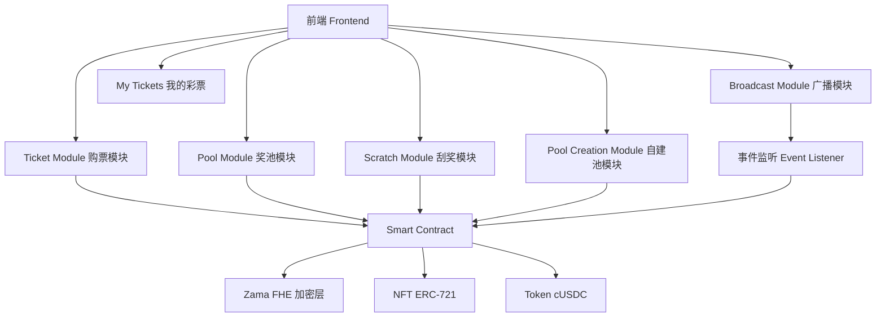
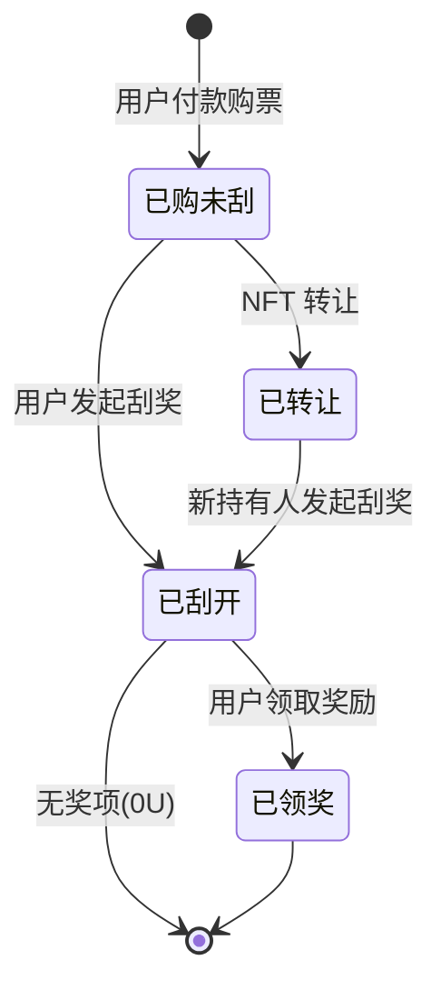
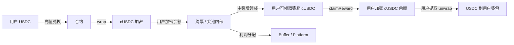
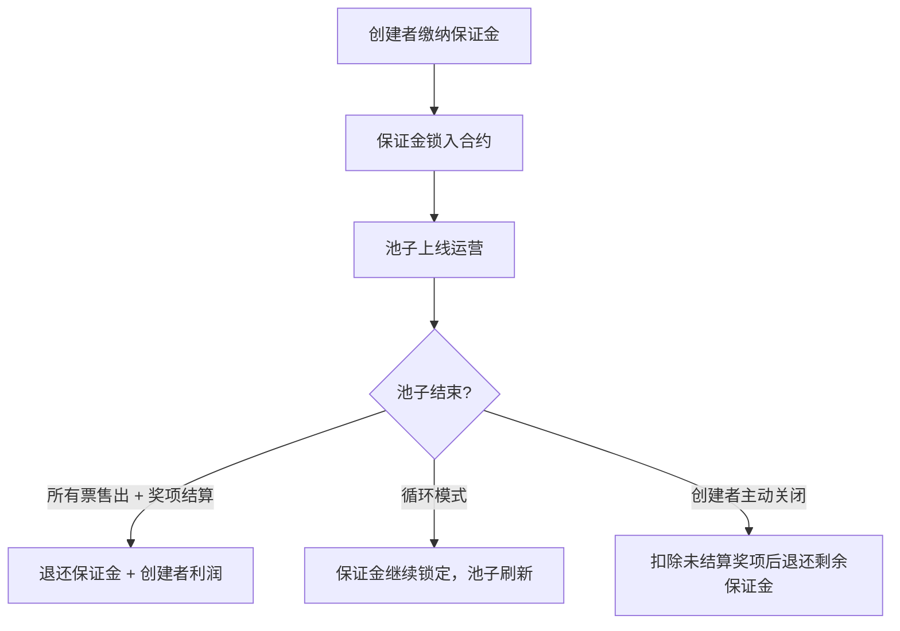
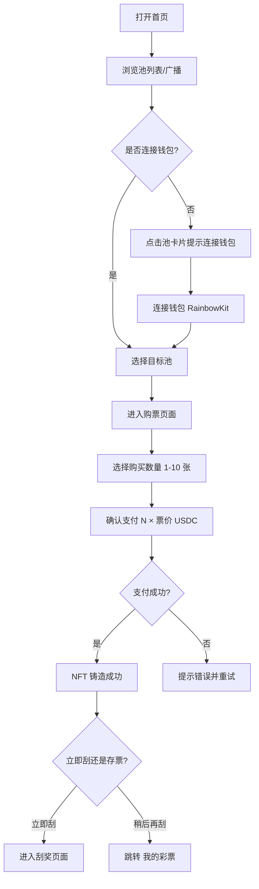
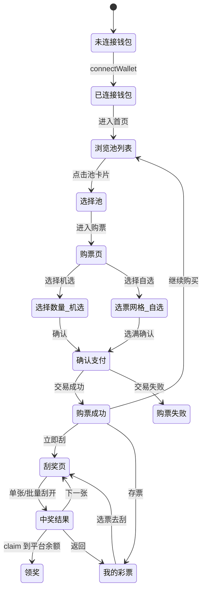

# LuckyScratch — 详细功能设计文档

## A Confidential Scratch Lottery on Zama

> 版本：v3.0 — 详细功能设计（面向 UI 设计 & 开发）
> 更新日期：2026-04-10
> 基础设计参考：[doc/design.md](./design.md)

---

# 目录

1. [项目概述](#1-项目概述)
2. [核心设计理念](#2-核心设计理念)
3. [系统架构](#3-系统架构)
4. [奖池系统设计（8 池详设）](#4-奖池系统设计8-池详设)
5. [隐私设计（Zama FHE）](#5-隐私设计zama-fhe)
6. [NFT 彩票设计](#6-nft-彩票设计)
7. [Token 与资金流设计](#7-token-与资金流设计)
8. [用户自建池系统](#8-用户自建池系统)
9. [中奖广播系统](#9-中奖广播系统)
10. [收益分配模型](#10-收益分配模型)
11. [Gasless 设计](#11-gasless-设计)
12. [风控系统](#12-风控系统)
13. [用户流程详细设计](#13-用户流程详细设计)
14. [页面设计详细规范](#14-页面设计详细规范)
15. [中奖效果设计规范](#15-中奖效果设计规范)
16. [交互状态机与逻辑规范](#16-交互状态机与逻辑规范)
17. [核心优势](#17-核心优势)
18. [二期功能规划](#18-二期功能规划)

---

# 1. 项目概述

## 1.1 项目定位

LuckyScratch 是一个基于 **Zama FHE（全同态加密）** 构建的隐私刮刮乐彩票系统，部署在公开区块链上，实现：

> 🎯 在"完全公开的链上环境"中，构建一个"不可博弈、不可推断、可持续"的彩票系统

## 1.2 核心问题

传统链上彩票的问题：

- ❌ 奖池透明 → 用户可推断是否值得购买
- ❌ 大奖被抽走 → 用户停止参与
- ❌ 资金流公开 → 套利与博弈行为严重

## 1.3 解决方案

LuckyScratch 通过：

- 🔐 加密奖池状态（FHE）
- 🎲 预分配奖项
- 🧱 多子池并行结构

实现：

> **"用户无法判断奖池状态，从而无法博弈"的系统**

## 1.4 产品定位关键词

链上刮刮乐 · 隐私彩票 · FHE 加密 · 不可篡改 · 可验证公正 · 用户自建池

---

# 2. 核心设计理念

## 2.1 不可博弈（Non-Gameable）

用户无法得知：

- 是否已出大奖
- 剩余奖项结构
- 当前奖池价值

👉 消除策略行为

## 2.2 确定性盈利（Deterministic Profitability）

- 每个奖池预分配奖项
- RTP 固定
- 数学上保证长期盈利

## 2.3 多池分散（Multi-Pool Parallelism）

- 不依赖单一奖池
- 多个子池同时运行
- 风险分散

## 2.4 隐私优先（Privacy-first）

所有敏感数据：

- 奖池余额
- 奖项库存
- 用户奖励

👉 均为加密状态

---

# 3. 系统架构

## 3.1 模块结构

系统主链路：

```text
Frontend (Next.js + DaisyUI)
  ↓
Relayer（Gas 代付）
  ↓
Smart Contract（Solidity + Zama FHE）
  ↓
区块链（Sepolia / 目标链）
```

核心模块：



## 3.2 技术栈

| 层 | 技术 |
| --- | --- |
| 前端 | Next.js (App Router) + TypeScript + DaisyUI + Tailwind CSS |
| 合约 | Solidity + Zama FHE (@fhevm/solidity) |
| 钱包 | RainbowKit + Wagmi + Viem |
| 加密 | Zama fhEVM（全同态加密） |
| NFT | ERC-721 |
| Gasless | Relayer 中继 |

---

# 4. 奖池系统设计（8 池详设）

## 4.1 池分组逻辑

8 个池分为 **两组**，每组 4 个池，覆盖 4 个价格档位（2U / 5U / 10U / 15U）：

| 分组 | 定位 | 中奖率 | 大奖率 | 用户体验 |
| --- | --- | --- | --- | --- |
| **A 组 — 高中奖率组** | 小奖频出，体验感强 | 高 (60-70%) | 低 (1-2%) | 经常中小奖，刮起来"有感觉" |
| **B 组 — 高大奖组** | 搏大奖，刺激感强 | 低 (25-35%) | 高 (5-8%) | 大多不中，但一中就是大的 |

## 4.2 八池主题命名 & 视觉定义

### A 组 — 高中奖率系列

| 池编号 | 主题名 | 英文名 | 票价 | 视觉主题 | 主色调 | 图标/装饰 |
| --- | --- | --- | --- | --- | --- | --- |
| A1 | 🏮 **鸿运当头** | Lucky Fortune | 2U | 中国红 / 金色祥云 | `#C62828` 正红 + `#FFD700` 金 | 红灯笼、祥云纹、金元宝 |
| A2 | 🌈 **彩虹宝藏** | Rainbow Treasure | 5U | 彩虹渐变 / 宝石 | 多色渐变 `#FF6B6B→#4ECDC4→#45B7D1→#FDBB2D` | 彩虹拱门、宝石、水晶 |
| A3 | 🌸 **樱花物语** | Sakura Story | 10U | 粉色樱花 / 日系清新 | `#FFB7C5` 樱粉 + `#FFF5F5` 浅粉 | 樱花花瓣飘落、和风元素 |
| A4 | ⭐ **星光满溢** | Starlight Overflow | 15U | 深蓝星空 / 银河 | `#1A237E` 深蓝 + `#E8EAF6` 星光银 | 流星、星座图案、银河背景 |

### B 组 — 高大奖率系列

| 池编号 | 主题名 | 英文名 | 票价 | 视觉主题 | 主色调 | 图标/装饰 |
| --- | --- | --- | --- | --- | --- | --- |
| B1 | 🐉 **龙腾万里** | Dragon Rise | 2U | 东方龙纹 / 古典金 | `#B8860B` 暗金 + `#1B1B1B` 深黑 | 金龙腾飞、火焰、古典纹样 |
| B2 | 💎 **钻石猎人** | Diamond Hunter | 5U | 钻石切面 / 冰蓝 | `#00BCD4` 冰蓝 + `#E0F7FA` 浅冰 | 钻石切面光效、闪耀光点 |
| B3 | 🔥 **黄金传奇** | Golden Legend | 10U | 奢华金 / 皇冠 | `#FFD700` 金 + `#212121` 黑金 | 皇冠、金条、闪光特效 |
| B4 | 🌌 **宇宙大奖** | Cosmic Jackpot | 15U | 太空 / 紫色星云 | `#6A1B9A` 宇宙紫 + `#E1BEE7` 星云粉 | 行星、火箭、星云背景 |

## 4.3 池参数详细设计

### A 组：高中奖率池（小奖频出）

#### A1 — 鸿运当头（2U 票价）

| 参数 | 数值 |
| --- | --- |
| 单池规模 | 100 USDC |
| 单张票价 | 2 USDC |
| 单池总票数 | 56 张 |
| 单池总销售额 | 112 USDC |
| 目标 RTP | 89.3% |
| 单池利润 | 12 USDC |
| 中奖率 | 66.1%（37/56 张有奖） |
| 大奖率 | 1.8%（1/56 张为大奖） |
| 子池数量 | 10 |

**奖项分配表：**

| 奖项金额 | 数量 | 小计 | 占比 |
| --- | --- | --- | --- |
| 20U（大奖） | 1 | 20U | 1.8% |
| 10U | 2 | 20U | 3.6% |
| 5U | 4 | 20U | 7.1% |
| 2U（回本奖） | 10 | 20U | 17.9% |
| 1U | 20 | 20U | 35.7% |
| 0U（未中奖） | 19 | 0U | 33.9% |
| **合计** | **56** | **100U** | **100%** |

---

#### A2 — 彩虹宝藏（5U 票价）

| 参数 | 数值 |
| --- | --- |
| 单池规模 | 250 USDC |
| 单张票价 | 5 USDC |
| 单池总票数 | 58 张 |
| 单池总销售额 | 290 USDC |
| 目标 RTP | 86.2% |
| 单池利润 | 40 USDC |
| 中奖率 | 62.1%（36/58 张有奖） |
| 大奖率 | 1.7%（1/58 张为大奖） |
| 子池数量 | 5 |

**奖项分配表：**

| 奖项金额 | 数量 | 小计 | 占比 |
| --- | --- | --- | --- |
| 50U（大奖） | 1 | 50U | 1.7% |
| 25U | 2 | 50U | 3.4% |
| 10U | 5 | 50U | 8.6% |
| 5U（回本奖） | 8 | 40U | 13.8% |
| 2U | 20 | 40U | 34.5% |
| 0U（未中奖） | 22 | 0U | 37.9% |
| **合计** | **58** | **250U** | **100%** |

---

#### A3 — 樱花物语（10U 票价）

| 参数 | 数值 |
| --- | --- |
| 单池规模 | 500 USDC |
| 单张票价 | 10 USDC |
| 单池总票数 | 59 张 |
| 单池总销售额 | 590 USDC |
| 目标 RTP | 84.7% |
| 单池利润 | 90 USDC |
| 中奖率 | 64.4%（38/59 张有奖） |
| 大奖率 | 1.7%（1/59 张为大奖） |
| 子池数量 | 3 |

**奖项分配表：**

| 奖项金额 | 数量 | 小计 | 占比 |
| --- | --- | --- | --- |
| 100U（大奖） | 1 | 100U | 1.7% |
| 50U | 2 | 100U | 3.4% |
| 20U | 5 | 100U | 8.5% |
| 10U（回本奖） | 10 | 100U | 16.9% |
| 5U | 20 | 100U | 33.9% |
| 0U（未中奖） | 21 | 0U | 35.6% |
| **合计** | **59** | **500U** | **100%** |

---

#### A4 — 星光满溢（15U 票价）

| 参数 | 数值 |
| --- | --- |
| 单池规模 | 750 USDC |
| 单张票价 | 15 USDC |
| 单池总票数 | 60 张 |
| 单池总销售额 | 900 USDC |
| 目标 RTP | 83.3% |
| 单池利润 | 150 USDC |
| 中奖率 | 66.7%（40/60 张有奖） |
| 大奖率 | 1.7%（1/60 张为大奖） |
| 子池数量 | 2 |

**奖项分配表：**

| 奖项金额 | 数量 | 小计 | 占比 |
| --- | --- | --- | --- |
| 150U（大奖） | 1 | 150U | 1.7% |
| 75U | 2 | 150U | 3.3% |
| 30U | 5 | 150U | 8.3% |
| 15U（回本奖） | 10 | 150U | 16.7% |
| 5U | 22 | 110U | 36.7% |
| 0U（未中奖） | 20 | 0U | 33.3% |
| **合计** | **60** | **750U** | **100%** |

---

### B 组：高大奖率池（搏大奖）

#### B1 — 龙腾万里（2U 票价）

| 参数 | 数值 |
| --- | --- |
| 单池规模 | 100 USDC |
| 单张票价 | 2 USDC |
| 单池总票数 | 56 张 |
| 单池总销售额 | 112 USDC |
| 目标 RTP | 89.3% |
| 单池利润 | 12 USDC |
| 中奖率 | 30.4%（17/56 张有奖） |
| 大奖率 | 5.4%（3/56 张为 ≥10U 大奖） |
| 子池数量 | 10 |

**奖项分配表：**

| 奖项金额 | 数量 | 小计 | 占比 |
| --- | --- | --- | --- |
| 30U（头奖） | 1 | 30U | 1.8% |
| 15U | 2 | 30U | 3.6% |
| 10U | 4 | 40U | 7.1% |
| 0U（未中奖） | 49 | 0U | 87.5% |
| **合计** | **56** | **100U** | **100%** |

> 特点：大部分票不中，但中就是大奖，单票最大回报 15 倍

---

#### B2 — 钻石猎人（5U 票价）

| 参数 | 数值 |
| --- | --- |
| 单池规模 | 250 USDC |
| 单张票价 | 5 USDC |
| 单池总票数 | 58 张 |
| 单池总销售额 | 290 USDC |
| 目标 RTP | 86.2% |
| 单池利润 | 40 USDC |
| 中奖率 | 27.6%（16/58 张有奖） |
| 大奖率 | 5.2%（3/58 张为 ≥25U 大奖） |
| 子池数量 | 5 |

**奖项分配表：**

| 奖项金额 | 数量 | 小计 | 占比 |
| --- | --- | --- | --- |
| 80U（头奖） | 1 | 80U | 1.7% |
| 40U | 2 | 80U | 3.4% |
| 5U（回本奖） | 6 | 30U | 10.3% |
| 2U | 7 | 14U | 12.1% |
| 0U（未中奖） | 42 | 0U | 72.4% |
| **合计** | **58** | **250U**(含 46U 分散小奖) | **100%** |

> 特点：头奖 80U（16 倍回报），绝大多数无奖

---

#### B3 — 黄金传奇（10U 票价）

| 参数 | 数值 |
| --- | --- |
| 单池规模 | 500 USDC |
| 单张票价 | 10 USDC |
| 单池总票数 | 59 张 |
| 单池总销售额 | 590 USDC |
| 目标 RTP | 84.7% |
| 单池利润 | 90 USDC |
| 中奖率 | 25.4%（15/59 张有奖） |
| 大奖率 | 6.8%（4/59 张为 ≥50U 大奖） |
| 子池数量 | 3 |

**奖项分配表：**

| 奖项金额 | 数量 | 小计 | 占比 |
| --- | --- | --- | --- |
| 200U（头奖） | 1 | 200U | 1.7% |
| 50U | 3 | 150U | 5.1% |
| 10U（回本奖） | 5 | 50U | 8.5% |
| 5U | 6 | 30U | 10.2% |
| 0U（未中奖） | 44 | 0U | 74.6% |
| **合计** | **59** | **500U**(含 70U 打底) | **100%** |

> 特点：头奖 200U（20 倍回报），刺激感极强

---

#### B4 — 宇宙大奖（15U 票价）

| 参数 | 数值 |
| --- | --- |
| 单池规模 | 750 USDC |
| 单张票价 | 15 USDC |
| 单池总票数 | 60 张 |
| 单池总销售额 | 900 USDC |
| 目标 RTP | 83.3% |
| 单池利润 | 150 USDC |
| 中奖率 | 28.3%（17/60 张有奖） |
| 大奖率 | 8.3%（5/60 张为 ≥50U 大奖） |
| 子池数量 | 2 |

**奖项分配表：**

| 奖项金额 | 数量 | 小计 | 占比 |
| --- | --- | --- | --- |
| 300U（头奖） | 1 | 300U | 1.7% |
| 100U | 2 | 200U | 3.3% |
| 50U | 2 | 100U | 3.3% |
| 15U（回本奖） | 5 | 75U | 8.3% |
| 5U | 7 | 35U | 11.7% |
| 0U（未中奖） | 43 | 0U | 71.7% |
| **合计** | **60** | **750U**(含 40U 打底) | **100%** |

> 特点：头奖 300U（20 倍回报），最高倍率池，终极刺激

---

## 4.4 全局 RTP 汇总

| 池名 | 组 | 票价 | RTP | 中奖率 | 大奖率 | 子池数 |
| --- | --- | --- | --- | --- | --- | --- |
| 🏮 鸿运当头 | A | 2U | 89.3% | 66.1% | 1.8% | 10 |
| 🌈 彩虹宝藏 | A | 5U | 86.2% | 62.1% | 1.7% | 5 |
| 🌸 樱花物语 | A | 10U | 84.7% | 64.4% | 1.7% | 3 |
| ⭐ 星光满溢 | A | 15U | 83.3% | 66.7% | 1.7% | 2 |
| 🐉 龙腾万里 | B | 2U | 89.3% | 30.4% | 5.4% | 10 |
| 💎 钻石猎人 | B | 5U | 86.2% | 27.6% | 5.2% | 5 |
| 🔥 黄金传奇 | B | 10U | 84.7% | 25.4% | 6.8% | 3 |
| 🌌 宇宙大奖 | B | 15U | 83.3% | 28.3% | 8.3% | 2 |

## 4.5 池选择 UI — 用户视角标签

池卡片上展示给用户的标签：

- **A 组标签：** `🎯 高中奖率` `常中小奖` `适合新手`
- **B 组标签：** `💥 搏大奖` `高倍回报` `刺激挑战`
- **价格标签：** `2U` `5U` `10U` `15U`
- **剩余票数：** 加密显示（仅显示"有票 / 售罄"状态，不暴露具体数字）

## 4.6 奖池刷新机制

触发条件：

- 该子池所有票都被抽完

资金来源：

- 本池利润
- Buffer

> 🔒 注意：池子剩余票数和中奖情况通过 Zama FHE 加密，链上公开但不可直接读取

## 4.7 随机性设计（Chainlink VRF）

平台采用“固定奖项集合 + Chainlink VRF 洗牌 + FHE 加密存储”方案：

1. 创建池时，先确定该池的奖项分布表与总票数。
2. 向 Chainlink VRF 请求随机数。
3. VRF 回调后，使用随机数对整组奖项结果做 Fisher-Yates 洗牌或等价随机排列。
4. 将洗牌后的每张彩票结果以加密状态写入链上。
5. 后续售票阶段仅分配这些已生成的彩票，不再二次抽奖。

设计结论：

- 奖项总量由业务参数决定。
- 中奖位置由 VRF 决定。
- 奖项明文由 FHE 保护。
- 用户购票与刮开阶段不再依赖新的随机数请求。

---

# 5. 隐私设计（Zama FHE）

## 5.1 加密数据

| 数据 | 加密方式 | 说明 |
| --- | --- | --- |
| 奖池余额 | `euint64` | 每个子池当前剩余的总奖金 |
| 奖项库存 | `euint32[]` | 每个子池各档位的剩余数量 |
| 剩余票数 | `euint32` | 每个子池剩余可购票数 |
| 用户中奖金额 | `euint64` | 对应彩票在建池时已确定，仅 NFT 持有人可解密 |
| 用户累计奖励 | `euint64` | 用户名下所有已刮奖励总和 |
| 刮奖结果 | `euint64` | 建池时写入，刮开时仅做授权解密揭晓 |

## 5.2 权限控制

| 数据 | 可见性 |
| --- | --- |
| 用户中奖 | 仅用户本人可解密 |
| 奖池状态（奖金余额/奖项库存） | 加密，任何人不可查看 |
| RTP 规则与奖项结构 | 公开 |
| 池票数与销售进度 | 公开 |
| 池是否有票 | 公开 |
| 子池总票数（初始配置） | 公开 |

权限说明：

- 奖池余额、奖项库存等系统状态始终以加密形式存储和计算。
- 每张彩票的中奖结果在池创建时就已预分配，并基于 Chainlink VRF 洗牌结果以加密状态写入链上。
- 单张彩票的中奖结果仅对当前 NFT 持有人可解密查看。
- 解密在用户前端本地完成，链上与前端之外不公开明文中奖结果。
- 当未刮开的 NFT 发生转移时，对应查看权限也随持有人变更而转移。
- 链上公开信息允许暴露票数、已售进度和票面编号占用情况，但不暴露具体奖项内容与奖金库存。

## 5.3 核心价值

> 用户无法推断"是否值得购买"——消除一切链上博弈

---

# 6. NFT 彩票设计

## 6.1 模型

每张彩票 = ERC721 NFT

NFT 生命周期：



1. 用户选择池类型并支付票价。
2. 池创建时，系统已基于 Chainlink VRF 完成奖项洗牌，并将该池全部彩票的结果预分配后以加密状态存储。
3. 合约为该次购票分配一张已加密的彩票，并铸造对应 NFT，初始状态为"未刮开"。
4. 在未刮开之前，中奖结果不会公开，但当前 NFT 持有人拥有刮开与查看资格。
5. 用户发起刮奖后，前端对该 NFT 绑定的加密结果进行本地解密并展示，NFT 状态更新为"已刮开"。
6. 当前 NFT 持有人可查看结果，并在中奖时发起领奖。

## 6.2 NFT 内容

包含：

- `tokenId`
- `owner`
- `poolId`（所属池编号 A1-B4）
- 状态（未刮 / 已刮 / 已领奖 / 已转让）
- `mintTimestamp`
- `transferCount`（转让次数）

说明：

- NFT 本身不直接公开存储中奖金额。
- NFT 的所有权决定该张已分配彩票结果的查看权与领奖权。
- 未刮开的 NFT 可转让。
- 已刮开的 NFT 不允许继续转让，查看权与领奖权固定归刮开后的当前持有人所有。

## 6.2.1 NFT 转让规则

> 🔄 未刮开的彩票 NFT 支持自由转让，转让后新持有人获得刮奖权和查看权。已刮开的彩票不可转让。

### 转让状态转换

| 当前状态 | 允许转让 | 转让后状态 | 说明 |
| --- | --- | --- | --- |
| 已购未刮 | ✅ 可转让 | 已转让（新持有人视角：已购未刮） | NFT 所有权转移，刮奖权、查看权随之转移 |
| 已转让（未刮开） | ✅ 可再次转让 | 已转让 | 支持多次流转，每次转让均更新持有人 |
| 已刮开 | ❌ 不可转让 | — | 刮奖后 NFT 锁定，防止中奖信息泄露后的投机转让 |
| 已领奖 | ❌ 不可转让 | — | 奖励已进入用户平台内余额 |

### 转让后刮奖规则

1. **新持有人发起刮奖**：转让后的 NFT 仅允许新持有人（当前 `owner`）发起刮奖操作。
2. **刮奖后不可转让**：一旦新持有人发起刮奖，NFT 立即进入「已刮开」状态，**不可再转让**。
3. **查看权转移**：在未刮开状态下，查看权始终跟随当前 NFT 持有人。原持有人转让后丧失所有权限。
4. **链上权限校验**：合约在 `scratchTicket()` 调用时校验 `msg.sender == ownerOf(tokenId)`，确保只有当前持有人可刮奖。
5. **转让记录上链**：每次转让触发 `TicketTransferred` 事件，记录 `from`、`to`、`tokenId`。

## 6.3 结果分配与揭晓

- 每个池在创建时就完成全部彩票结果的预分配。
- 预分配前先通过 Chainlink VRF 为整组奖项结果生成随机排列。
- 这些结果以加密状态写入链上，外部无法直接判断某张票是否中奖。
- 用户购票时，只是领取一张已经存在但尚未揭晓的加密彩票 NFT。
- 用户刮开时，不是重新抽奖，而是对该 NFT 绑定结果进行授权解密与展示。

### 转让 UI 入口

- 「我的彩票」页面中，未刮开的彩票卡片显示 **[转让]** 按钮。
- 点击后弹出转让 Modal：
  - 输入目标地址（支持 ENS 解析）
  - 确认转让提示："转让后您将失去该彩票的所有权限，包括刮奖权和查看权"
  - 确认按钮
- 转让成功后 Toast 通知，卡片从列表移除。

## 6.3 NFT 视觉

每张 NFT 的外观根据所属池主题动态生成：

| 池 | NFT 正面装饰 | 刮开区域样式 | 刮开后背景 |
| --- | --- | --- | --- |
| 🏮 鸿运当头 | 大红底 + 金色纹理 + 灯笼图案 | 金色涂层 | 红色烟花绽放 |
| 🌈 彩虹宝藏 | 彩虹渐变底 + 宝石散落 | 银色闪光涂层 | 宝石旋转动画 |
| 🌸 樱花物语 | 粉色底 + 飘落樱花 | 磨砂粉涂层 | 樱花雨动画 |
| ⭐ 星光满溢 | 深蓝星空底 + 闪烁星点 | 星辰涂层 | 流星划过动画 |
| 🐉 龙腾万里 | 暗金底 + 龙纹浮雕 | 古铜涂层 | 金龙飞腾动画 |
| 💎 钻石猎人 | 冰蓝底 + 钻石折射 | 冰晶涂层 | 钻石旋转闪光 |
| 🔥 黄金传奇 | 黑金底 + 闪光粒子 | 黄金涂层 | 金币下落动画 |
| 🌌 宇宙大奖 | 太空紫底 + 星云 | 星云涂层 | 行星爆发动画 |

## 6.4 加密数据存储

NFT 不存储：

- 奖励
- 中奖信息

这些由加密状态管理。

解密与查看流程：

1. 池创建时，合约已为每张彩票写入加密结果。
2. 用户购票后获得对应 NFT，也获得该票的刮开与查看资格。
3. 用户持有 NFT 并发起查看请求。
4. 系统校验当前持有人身份。
5. 前端获取该 NFT 对应的加密结果。
6. 由当前 NFT 持有人在前端本地完成解密并展示中奖结果。

---

# 7. Token 与资金流设计

## 7.1 资金流



## 7.2 使用方式

- 充值入口：USDC 兑换为 cUSDC
- 游戏内部：cUSDC 全程以加密态流转
- 领奖入口：刮开后先 claim 到用户加密 cUSDC 余额
- 用户提取：再将 cUSDC unwrap 为 USDC

---

# 8. 用户自建池系统

## 8.1 功能概述

除平台官方运营的 8 个主题池外，LuckyScratch 允许任何用户创建自己的彩票池，实现「彩票发行权下放」。

> 🎫 任何用户都可以成为彩票发行方，创建自己的刮刮乐奖池

用户创建池子的前提是缴纳**保证金（Bond）**，保证金金额由池子规模决定，确保池子有足够的资金覆盖所有奖项。

## 8.2 保证金机制（Bond System）

### 保证金计算规则

保证金 = 池子奖金总额 + 保证金比例加成

| 池子奖金规模 | 保证金比例 | 示例 |
| --- | --- | --- |
| 50 - 200 USDC | 奖金总额 + 20% | 100U 池 → 保证金 120 USDC |
| 201 - 500 USDC | 奖金总额 + 15% | 300U 池 → 保证金 345 USDC |
| 501 - 2000 USDC | 奖金总额 + 10% | 1000U 池 → 保证金 1100 USDC |

### 保证金用途

| 用途 | 说明 |
| --- | --- |
| 奖金覆盖 | 保证金中的奖金部分直接锁入合约，确保所有奖项 100% 有资金支付 |
| 风险保障 | 加成部分作为风险保障金，防止创建者中途放弃 |
| 退还机制 | 池子正常结束（所有票售出且所有奖项结算完毕）后，剩余保证金退还给创建者 |

### 保证金生命周期



资金约束：

- 保证金中的奖金部分始终优先服务于未结算奖项。
- 循环模式进入下一轮前，系统会先锁定下一轮所需奖金准备金。
- 创建者只能提取扣除未结算奖项、下一轮准备金、平台手续费、Sponsor/Infra 成本后的已实现利润。
- 若可用余额不足以覆盖下一轮奖金，则循环模式自动停止，不再刷新。

## 8.3 池参数设置

创建者在创建池子时可以自定义以下参数：

| 参数 | 范围/选项 | 说明 |
| --- | --- | --- |
| 池名称 | 自定义（2-20 字符） | 池子的显示名称 |
| 池描述 | 自定义（最多 100 字符） | 池子的简短描述 |
| 单张票价 | 1 / 2 / 5 / 10 / 15 / 20 USDC | 预设档位，创建者选择 |
| 奖金总额 | 50 - 2000 USDC | 决定池子规模和保证金 |
| 总票数 | 系统根据票价和奖金自动计算建议值，创建者可微调 | 票数 ≥ ceil(奖金总额 / 票价 / 目标RTP) |
| 中奖率 | 20% - 70% | 中奖票（金额 > 0）占总票数的比例 |
| 最高单张奖金 | ≤ 奖金总额的 30% | 防止过度集中 |
| 奖项分布 | 创建者自行分配各奖项金额和数量 | 所有奖项金额之和 = 奖金总额 |
| 循环模式 | 一次性 / 循环 | 详见 8.4 |
| 池主题色 | 预设颜色方案中选择 | 影响池卡片和彩票视觉 |

### 参数校验规则

| 校验项 | 规则 | 错误提示 |
| --- | --- | --- |
| 奖项总额 | 必须 = 设定的奖金总额 | "奖项金额之和必须等于奖金总额" |
| 中奖率 | 中奖票数 / 总票数 必须在 20%-70% 范围 | "中奖率需在 20%-70% 之间" |
| 最高奖金 | ≤ 奖金总额 × 30% | "单张最高奖金不得超过奖金总额的 30%" |
| 总票数 | 总销售额必须 > 奖金总额 + 平台手续费 | "票数设置不合理，无法覆盖成本" |
| RTP | 实际 RTP 必须在 50%-95% 范围 | "返奖率需在 50%-95% 之间" |

## 8.4 循环模式设计

### 一次性模式（One-time）

- 所有票售完后，池子自动关闭
- 奖项全部结算完毕后，退还保证金 + 创建者利润
- 适合：限量活动、试水性质的池子

### 循环模式（Loop）

- 所有票售出后，池子使用相同奖项结构自动刷新进入下一轮
- 新一轮奖金从锁定保证金与上一轮已结算可复用利润中补充
- 循环条件：创建者保证金余额足够覆盖下一轮奖金
- 创建者可随时关闭循环（当前轮售完后生效，不影响已售出的票）
- 每轮结束时自动结算上一轮利润

| 模式 | 售完后行为 | 保证金退还时机 | 适用场景 |
| --- | --- | --- | --- |
| 一次性 | 池子关闭 | 所有奖项结算后立即退还 | 限量活动、测试 |
| 循环 | 自动刷新下一轮 | 创建者主动关闭并结算后退还 | 长期运营、持续发行 |

## 8.5 平台手续费

平台对用户自建池收取手续费，确保平台可持续运营：

| 费用项 | 费率 | 计算基础 | 说明 |
| --- | --- | --- | --- |
| 销售手续费 | 8% | 每张票销售额 | 每售出一张票，平台实时抽取 8% |
| 创建费 | 0 | — | 不收取创建费用（降低门槛） |
| 提取手续费 | 0 | — | 创建者利润提取不额外收费 |

### 收益计算示例

假设创建者创建一个 100U 池，票价 2U：

| 项目 | 计算 | 金额 |
| --- | --- | --- |
| 总票数 | 约 56 张（参考官方池结构） | — |
| 总销售额 | 56 × 2U | 112 USDC |
| 奖金支出 | 预设奖金总额 | 100 USDC |
| 平台手续费 | 112 × 8% | 8.96 USDC |
| **创建者利润** | 112 - 100 - 8.96 | **3.04 USDC** |

> 💡 创建者的利润 = 总销售额 - 奖金总额 - 平台手续费。创建者可通过调整 RTP（降低返奖率）来提高利润，但中奖率过低会影响用户参与意愿。

循环池口径补充：

- `可提取利润 = 已实现收入 - 已结算奖金 - 平台手续费 - Sponsor/Infra 成本 - 下一轮保留奖金`
- 若池子仍处于循环模式，则“下一轮保留奖金”优先于创建者利润提取。

## 8.6 池审核与上线

| 步骤 | 说明 |
| --- | --- |
| 1. 参数填写 | 创建者在前端填写所有池参数 |
| 2. 参数校验 | 系统自动校验参数合理性（见 8.3 校验规则） |
| 3. 保证金缴纳 | 创建者确认并缴纳保证金，资金锁入合约 |
| 4. 请求 VRF | 系统向 Chainlink VRF 请求随机数 |
| 5. 奖项洗牌并加密 | VRF 回调后完成奖项洗牌，并使用 Zama FHE 加密结果 |
| 6. 池上线 | 池子出现在「用户池」Tab 下，对所有用户可见 |

> 🔒 一期无人工审核，通过合约参数校验即可上线。二期可引入社区举报和管理员审核机制。

## 8.7 创建者管理面板

创建者可在「我的池子」页面管理自己创建的所有池：

| 数据项 | 说明 |
| --- | --- |
| 池状态 | 运营中 / 已售罄 / 已关闭 |
| 已售票数 / 总票数 | 销售进度 |
| 当前轮数 | 第 N 轮（循环模式） |
| 销售收入 | 已产生的总收入 |
| 平台手续费 | 已扣除的手续费 |
| 已派奖金额 | 已支付的奖金 |
| 可提取利润 | 扣除未结算奖项与下一轮保留金后的当前可提取利润 |
| 保证金状态 | 锁定中 / 可退还 / 部分退还 |
| 操作 | 提取利润 / 关闭池子 / 查看详情 |

## 8.8 用户池展示

在首页和彩票商店中，用户自建池与官方池分开展示：

| Tab | 内容 |
| --- | --- |
| 🏛️ 官方池 | 平台运营的 8 个主题池 |
| 👤 用户池 | 所有用户创建的池子 |

用户池卡片显示：

- 池名称 + 创建者地址（脱敏）
- 票价 + 中奖率 + 最高奖金
- 销售进度（已售 / 总票数）
- 模式标签（一次性 / 循环）
- 有票 / 售罄状态

说明：

- 为支持自选购票，票面编号占用情况与销售进度默认公开。
- 公开的是“哪张票已售出”，不是“哪张票会中奖”。

### 用户池排序规则

| 排序方式 | 说明 |
| --- | --- |
| 默认 | 最新创建优先 |
| 热门 | 按近 24 小时销量排序 |
| 中奖率 | 按中奖率从高到低 |
| 票价 | 按票价从低到高 |

## 8.9 合约接口

| 函数 | 说明 |
| --- | --- |
| `createPool(params)` | 创建池子（含保证金锁定） |
| `closePool(poolId)` | 创建者关闭池子 |
| `withdrawCreatorProfit(poolId)` | 创建者提取利润 |
| `refundBond(poolId)` | 退还保证金（池子结束后） |
| `getPoolsByCreator(address) → poolId[]` | 查询创建者的所有池 |
| `getPoolInfo(poolId) → PoolInfo` | 查询池详情 |

## 8.10 事件定义

| 事件 | 说明 |
| --- | --- |
| `PoolCreated(creator, poolId, bondAmount, poolSize)` | 池子创建成功 |
| `PoolClosed(poolId, creator)` | 池子关闭 |
| `PoolRefreshedByCreator(poolId, round)` | 循环池刷新（新一轮） |
| `BondRefunded(poolId, creator, amount)` | 保证金退还 |
| `CreatorProfitWithdrawn(poolId, creator, amount)` | 创建者提取利润 |

---

# 9. 中奖广播系统

## 9.1 功能概述

首页顶部设置实时中奖广播滚动栏，展示最新中奖信息，提升平台的可信度和吸引力。

## 9.2 广播数据来源


- 监听链上 `ScratchResult` 事件
- 过滤中奖金额 > 0 的事件
- 提取：用户地址（脱敏）、中奖金额、池名

## 9.3 广播内容格式

```
🎉 0x1a2b...3c4d 在「鸿运当头」中赢得 20 USDC！
💎 0x5e6f...7g8h 在「钻石猎人」中赢得 80 USDC！
🔥 0xab12...cd34 在「黄金传奇」中赢得 200 USDC！恭喜！
```

## 9.4 广播 UI 规范

| 属性 | 规范 |
| --- | --- |
| 位置 | 首页顶部，Logo 下方，固定可见区域 |
| 样式 | 横向滚动/轮播，每条 3-5 秒自动切换 |
| 背景 | 半透明深色玻璃拟态 + 金色/绿色光效边框 |
| 文字 | 白色主体 + 金色高亮金额 + Emoji 前缀 |
| 动画 | 从右向左平滑滚动，或垂直上滑轮播 |
| 中奖音效 | 大奖（≥50U）播放特殊音效（可选） |
| 空状态 | 若暂无中奖记录，显示"等待幸运儿诞生…" |

## 9.5 隐私保护

- 用户地址仅展示前 4 位 + 后 4 位
- 中奖金额在链上以加密形式存储，但刮奖后该笔金额可被链上事件广播
- 用户可在设置中选择"隐身模式"不出现在广播中（二期功能）

---

# 10. 收益分配模型

## 10.1 单池利润公式

`单池利润 = 单池总销售额 - 单池总派奖预算`

补充说明：

- 这里的“单池总派奖预算”只包含奖项金额本身。
- 链上 Gas、Zama 协议费用、Chainlink VRF 费用不计入派奖预算，而是由协议侧单独承担。

## 10.2 各池利润概览

| 池名 | 总销售额 | 总奖金 | 单池利润 | 子池数 | 总利润 |
| --- | --- | --- | --- | --- | --- |
| 🏮 鸿运当头 | 112U | 100U | 12U | 10 | 120U |
| 🌈 彩虹宝藏 | 290U | 250U | 40U | 5 | 200U |
| 🌸 樱花物语 | 590U | 500U | 90U | 3 | 270U |
| ⭐ 星光满溢 | 900U | 750U | 150U | 2 | 300U |
| 🐉 龙腾万里 | 112U | 100U | 12U | 10 | 120U |
| 💎 钻石猎人 | 290U | 250U | 40U | 5 | 200U |
| 🔥 黄金传奇 | 590U | 500U | 90U | 3 | 270U |
| 🌌 宇宙大奖 | 900U | 750U | 150U | 2 | 300U |
| **全部** | — | — | — | — | **1780U** |

## 10.3 利润分配比例（以 A1 池为例）

| 项目 | 金额 | 占利润比例 |
| --- | --- | --- |
| Gas Sponsor | 3U | 25% |
| Infra | 1.8U | 15% |
| 平台 | 4.2U | 35% |
| Buffer | 3U | 25% |
| **合计** | **12U** | **100%** |

说明：

- `Gas Sponsor` 用于承担购票、刮奖相关链上 Gas。
- `Infra` 用于承担协议基础设施成本，包括 Zama 协议费用与 Chainlink VRF 费用。
- 用户侧不单独支付上述三类成本。

---

# 11. Gasless 设计

## 11.1 模式

`用户签名 → Relayer → 合约执行`

协议侧代付范围：

- 购票与刮奖相关链上 Gas
- Zama 协议费用
- Chainlink VRF 预言机费用

说明：

- 上述费用统一由协议侧承担，并从 Sponsor / Infra 预算中结算。
- 提取交易仍由用户自行支付链上 Gas。

## 11.2 覆盖范围

### 走 Gasless 的操作

- `purchaseTickets(poolId, quantity)`
- `purchaseTicketsWithSelection(poolId, ticketIndexes[])`
- `scratchTicket(tokenId)`
- `batchScratch(tokenIds[])`

### 不走 Gasless 的操作

- `claimReward(tokenId)`
- `batchClaimRewards(tokenIds[])`
- `withdrawCreatorProfit(poolId)`
- `refundBond(poolId)`

设计原则：

- 平台代付高频、强体验导向的交互。
- 涉及资金提现/提取出平台的操作由用户自行支付 Gas。
- Relayer 不应成为任意合约调用代理，只服务固定白名单函数。
- 与购票、刮奖配套的 Zama 协议费用和 Chainlink VRF 费用也由协议统一承担。

## 11.3 参与角色

| 角色 | 职责 |
| --- | --- |
| 用户前端 | 生成待签名消息、展示授权内容、提交到 Relayer |
| 用户钱包 | 对指定操作进行签名授权 |
| Chainlink VRF | 在建池时提供可验证随机数，用于奖项洗牌 |
| Relayer | 校验签名与风控规则，代表用户广播交易 |
| Gas Sponsor | 提供 Gas 预算，按池利润结算成本 |
| Infra Budget | 承担 Zama 协议费用与 Chainlink VRF 费用 |
| 业务合约 | 校验签名、nonce、deadline，并执行白名单操作 |

## 11.4 随机性职责边界

- Chainlink VRF 只用于建池阶段，不参与购票、刮奖、领奖流程。
- Relayer 只负责代付与转发交易，不负责生成随机性。
- FHE 只负责加密与权限化揭晓，不负责提供随机源。
- 协议侧统一承担 Gas、Zama 协议费和 VRF 费用，用户无需单独支付。

因此三者分工明确：

- VRF：决定奖项位置
- FHE：隐藏奖项内容
- Relayer：优化交互体验

## 11.5 签名模型

推荐使用 EIP-712 Typed Data，对每一笔 Gasless 请求签名。

### 签名字段

| 字段 | 说明 |
| --- | --- |
| `user` | 当前用户地址 |
| `action` | 操作类型，如 `PURCHASE` / `SCRATCH` |
| `targetContract` | 被调用合约地址 |
| `paramsHash` | 调用参数哈希，防止参数被篡改 |
| `nonce` | 用户级递增 nonce，防重放 |
| `deadline` | 授权失效时间 |
| `chainId` | 限定链 ID |

### 示例结构

```ts
type GaslessRequest = {
  user: Address;
  action: "PURCHASE" | "SCRATCH";
  targetContract: Address;
  paramsHash: Hex;
  nonce: bigint;
  deadline: bigint;
  chainId: bigint;
};
```

说明：

- `paramsHash` 应与具体函数参数一一对应，例如 `poolId + quantity` 或 `tokenId[]`。
- 合约侧不信任 Relayer 传入的裸参数，必须验证它们与签名中的 `paramsHash` 一致。
- 签名有效期建议较短，例如 5 到 15 分钟。
- 费用展示上，前端应明确告知用户：购票/刮奖阶段的 Gas、Zama 协议费、VRF 费用均由协议承担。

## 11.6 购票 Gasless 流程

1. 用户在前端选择池和数量。
2. 若平台内 `cUSDC` 余额不足，则先完成充值兑换，不走 Gasless。
3. 前端构造 `purchase` 请求，包含 `poolId`、`quantity`、`nonce`、`deadline`。
4. 用户钱包对 Typed Data 进行签名。
5. 前端将签名包发送给 Relayer。
6. Relayer 校验：
   - 签名是否有效
   - nonce 是否未使用
   - deadline 是否过期
   - 用户是否通过风控
   - Sponsor 预算是否足够
7. Relayer 调用合约中的受控入口执行购票。
8. 合约再次校验签名与 nonce，执行购票并消耗 nonce。
9. 前端根据链上回执展示成功/失败结果。

## 11.7 刮奖 Gasless 流程

1. 用户在彩票页面触发刮开动作。
2. 当前端判定刮开面积达阈值后，生成 `scratch` 请求。
3. 用户签名授权刮开指定 `tokenId` 或 `tokenIds[]`。
4. Relayer 校验 NFT 当前持有人、请求时效与风控限制。
5. Relayer 发起链上交易。
6. 合约校验签名与 `ownerOf(tokenId)` 一致后执行刮开。
7. 前端读取该票已预分配的加密结果并本地解密展示。

## 11.8 合约侧约束

合约必须提供受控的 Relayer 执行入口，并在链上完成以下校验：

- 仅允许白名单 action
- 校验 EIP-712 签名
- 校验 `chainId`、`targetContract`
- 校验 `nonce` 未使用
- 校验 `deadline` 未过期
- 校验调用参数与 `paramsHash` 一致
- 对刮奖操作校验 `msg.sender` 代表的请求用户确为当前 NFT 持有人
- 对建池流程校验 VRF 回调只可写入一次随机洗牌结果
- 奖池进入“可售”状态前，必须先完成 VRF 随机数回填与结果加密写入

建议：

- 为每个用户维护独立 nonce：`mapping(address => uint256) nonces`
- nonce 在成功执行后递增，避免重复广播
- 将 `RelayerExecuted`、`RelayerRejected` 结果事件化，便于审计与前端追踪

## 11.9 Relayer 风控规则

| 风控项 | 规则 |
| --- | --- |
| 用户频率 | 仅做短时速率限制与异常防刷，不设置按日次数上限 |
| 批量大小 | 单次购票张数、单次批量刮奖数量上限 |
| Gas 上限 | 单笔最大 gas limit 和最大 sponsor 成本 |
| 白名单函数 | 仅允许购票/刮奖相关方法 |
| 预算保护 | Sponsor 日预算、池预算、全局预算三层限额 |
| 异常回滚 | 连续失败达到阈值时暂停该用户或该池的 Gasless |

## 11.10 Sponsor 结算方式

- Gas Sponsor 成本先由平台垫付。
- Zama 协议费用与 Chainlink VRF 费用由 Infra 预算垫付。
- 结算时按池维度从对应利润池中扣减。
- 若单池利润不足，可临时由平台总 Sponsor / Infra 池补足，再做内部记账。
- Sponsor 与 Infra 支出应单独统计，不能混入派奖预算。

## 11.11 降级与兜底

- Relayer 服务不可用：前端切换为普通链上交易模式。
- Sponsor 余额不足：隐藏或禁用 Gasless 按钮，但保留手动发送交易入口。
- 签名过期：前端提示重新签名，不自动重放旧请求。
- 风控拒绝：提示原因，允许用户改为自行支付 Gas。
- 链上执行失败：Relayer 不重用同一签名自动无限重试，避免重复消费风险。
- VRF 回调未完成：池状态保持“初始化中”，前端不可售卖。
- VRF 请求失败：允许管理员或创建者重新触发建池初始化，但不得绕过随机流程直接上架。

## 11.12 前端交互要求

- Gasless 按钮需明确标识为“免 Gas”或“平台代付”。
- 用户签名前展示本次操作摘要：池名、数量、目标票、过期时间。
- 若当前操作不支持 Gasless，按钮文案直接展示“自行支付 Gas”。
- 前端应区分三类状态：签名中、Relayer 提交中、链上确认中。
- 当请求进入队列但未上链时，允许用户看到明确的 pending 状态，避免重复点击。

---

# 12. 风控系统

## 12.1 风险类型

| 类型 | 状态 |
| --- | --- |
| 用户博弈 | 已解决（FHE 加密） |
| 数学亏损 | 不存在（RTP 预算固定） |
| 资金错配 | 存在 |
| 流动性压力 | 存在 |

## 12.2 风控措施

### Buffer

`5% - 15%` 利润留存

### 奖池耗尽后重建

仅在奖池奖项耗尽后刷新并重建新池，新池资金来自该池利润预留与 Buffer。

### 结果分布原则

奖项位置在建池时由 VRF 一次性洗牌确定，运行时不再做人工或策略性节奏调控。

---

# 13. 用户流程详细设计

## 13.1 首次进入流程



## 13.2 购票流程详细

### 步骤 1：选择池

- 浏览 8 种池的卡片
- 可按「高中奖率」和「搏大奖」两个 Tab 筛选
- 可按价格排序
- 池卡片上展示：主题名 + 票价 + 组别标签 + 有票/售罄状态 + 最高奖金

### 步骤 2：确认购买

- 选中池后弹出购票 Modal：
  - 池名称 & 主题
  - 单价
  - 数量选择器（1-10 张，可 +/- 调节）
  - 总价 = 数量 × 单价
  - 最高奖金提示
  - 分组标签（高中奖率/搏大奖）
  - 确认购买按钮

### 步骤 3：支付

- 调用合约 `purchaseTickets(poolId, quantity)`
- 用户确认使用平台内 cUSDC 余额支付
- 若余额不足，则先批准 USDC 额度并完成充值兑换
- 发起购买交易
- 显示交易状态（pending → success / fail）

### 步骤 4：获得 NFT 彩票

- 铸造 N 张 NFT，显示铸造成功弹窗
- 弹窗选项：
  - 「🎲 立即开刮」→ 跳转刮奖页面
  - 「📦 存入我的彩票」→ 跳转我的彩票页面
  - 「🛒 继续购买」→ 返回池列表

## 13.3 选票方式

用户购买时可以选择两种选票方式：

| 方式 | 说明 | UI 表现 |
| --- | --- | --- |
| **机选** | 系统按当前可售票集合自动分配 N 张 | 用户只选数量，点击确认即可 |
| **自选** | 用户在可视化的票面网格中逐一挑选 | 展示当前池的可用票面（编号格子），用户手动点选 |

> 🔒 注意：自选时用户看到的只是票的编号/位置，看不到内容（FHE 加密），自选仅是"位置偏好"的体验设计

### 自选页面展示

- 进入后显示一个 N×M 的票面网格
- 每个格子代表一张可选票
- 已售出的格子灰色不可选
- 用户点击选中（高亮边框），可多选
- 选满所购数量后激活确认按钮

## 13.4 刮奖流程详细

### 单张刮

1. 进入刮奖页面，显示一张 NFT 彩票正面
2. 用手指/鼠标在「刮奖区域」滑动
3. 触发 Canvas 刮开动画（涂层逐渐擦除）
4. 刮开面积超过 70% 时自动触发链上刮奖交易
5. 链上合约校验当前用户对该 NFT 的刮开权限
6. 前端接收该票已预分配的加密结果并本地解密
7. 播放中奖 / 未中奖动画
8. 显示奖金数额

### 批量刮

1. 在"我的彩票"中选择多张未刮票
2. 点击「批量开刮」按钮
3. 批量刮模式：
   - 依次播放每张票的快速刮开动画（每张 1-2 秒）
   - 或选择「一键全刮」直接显示所有结果
4. 汇总结果页面：
   - 总共刮了 N 张
   - 中奖 M 张
   - 总中奖金额 X USDC
   - 每张的具体结果列表
   - 「领取奖励」按钮

### 刮奖动画规范

> 📌 完整的中奖效果设计规范（分层反馈、奖励分级、隐私揭晓动效、领奖交互等）请参见 [第 15 章 — 中奖效果设计规范](#15-中奖效果设计规范)。以下为快速概览。

| 元素 | 规范 |
| --- | --- |
| 涂层材质 | 根据池主题变化（金色/银色/冰晶/星云...） |
| 刮除效果 | Canvas 橡皮擦效果，带粒子碎片 |
| 进度触发 | 刮开 70% 面积触发合约交互 |
| 解密过渡 | 刮开后 0.8-1.5 秒"Decrypting result..."科技感过渡（详见 15.3） |
| 中奖反馈 | 按奖级分 4 档差异化展示（详见 15.4） |
| 未中奖反馈 | 柔和灰色渐隐 + 平静文案（详见 15.4.1） |
| 大奖反馈 | 爆发式高亮 + 金色粒子 + 数字滚动（详见 15.4.4） |
| 隐私提示 | 每次揭晓均显示 "This result is only visible to you" |

## 13.5 提取流程

1. 用户刮开中奖彩票后，点击 `claimReward` 将奖励领取到用户加密 cUSDC 余额
2. 累计余额可在"我的钱包"中查看
3. 用户点击「提取」按钮
4. 输入提取金额（或全额提取）
5. 用户自行支付 Gas 发起提取
6. `cUSDC → unwrap → USDC` 到用户钱包
7. 显示提取成功/链接到区块链浏览器

---

# 14. 页面设计详细规范

## 14.0 全局设计风格

| 属性 | 规范 |
| --- | --- |
| 整体风格 | 暗色系为主 + 金色/霓虹点缀，刮刮乐彩票娱乐氛围 |
| 背景 | 深色渐变（`#0D0D0D` → `#1A1A2E`）+ 微弱粒子动画 |
| 卡片风格 | 玻璃拟态（Glassmorphism）+ 柔和圆角 + 悬停发光 |
| 字体 | 英文用 `Outfit` 或 `Inter`；中文用系统默认 |
| 动画 | 丰富的微交互动画：hover 放大、按钮波纹、卡片倾斜 3D 效果 |
| 色彩体系 | 主色金色 `#FFD700`、深色背景、各池有独立主题色 |
| 图标 | 使用 Emoji + 自定义 SVG 图标混搭 |
| 响应式 | 移动端优先，支持 PC/平板/手机 |

## 14.1 首页（Home Page）

### 页面结构

```
┌──────────────────────────────────────────┐
│  顶部导航栏（Logo + 钱包连接 + 导航链接）    │
├──────────────────────────────────────────┤
│  🏆 中奖广播滚动条                        │
│  "🎉 0x1a2b..3c4d 在鸿运当头中赢得 20U!"   │
├──────────────────────────────────────────┤
│  Hero Banner（主视觉区域）                  │
│  LuckyScratch 大标题 + 副标题              │
│  "链上刮刮乐 · 公正透明 · 加密保障"          │
│  [立即开始] [了解更多]                      │
├──────────────────────────────────────────┤
│  统计展示栏                               │
│  [总奖金池] [已发放奖金] [活跃用户] [在线人数] │
├──────────────────────────────────────────┤
│  池分组 Tab 切换                          │
│  [🎯 高中奖率] [💥 搏大奖] [全部]           │
├──────────────────────────────────────────┤
│  池卡片网格（2×4 或响应式）                  │
│  ┌────────┐ ┌────────┐ ┌────────┐ ┌────┐ │
│  │🏮鸿运当头│ │🌈彩虹宝藏│ │🌸樱花物语│ │⭐星光│ │
│  │  2U    │ │  5U    │ │  10U   │ │ 15U│ │
│  │ 高中奖率 │ │ 高中奖率 │ │ 高中奖率 │ │高中奖│ │
│  │[开始购买]│ │[开始购买]│ │[开始购买]│ │[购买]│ │
│  └────────┘ └────────┘ └────────┘ └────┘ │
│  ┌────────┐ ┌────────┐ ┌────────┐ ┌────┐ │
│  │🐉龙腾万里│ │💎钻石猎人│ │🔥黄金传奇│ │🌌宇宙│ │
│  │  2U    │ │  5U    │ │  10U   │ │ 15U│ │
│  │ 搏大奖  │ │ 搏大奖  │ │ 搏大奖  │ │搏大奖│ │
│  │[开始购买]│ │[开始购买]│ │[开始购买]│ │[购买]│ │
│  └────────┘ └────────┘ └────────┘ └────┘ │
├──────────────────────────────────────────┤
│  创建池子入口                               │
│  "发行你自己的刮刮乐 · 赚取发行收益"           │
│  已有 XX 个用户池运营中                      │
│  [创建我的池子]                             │
├──────────────────────────────────────────┤
│  系统特点展示（3 列）                       │
│  [🔐 FHE 加密] [🎲 公正透明] [💰 高回报率]  │
├──────────────────────────────────────────┤
│  Footer（版权 · 链接 · 合约地址）           │
└──────────────────────────────────────────┘
```

### 池卡片设计要素

每张池卡片包含：

| 元素 | 说明 |
| --- | --- |
| 主题图标 | 对应 Emoji 或 SVG |
| 主题名 | 中文名称（如"鸿运当头"） |
| 票价 | 大字显示（如 "2 USDC"） |
| 分组标签 | 高中奖率 / 搏大奖（不同颜色 Badge） |
| 最高奖金 | "最高可赢 XX USDC"（金色高亮） |
| 中奖率标签 | "中奖率 66%" / "大奖率 8.3%" |
| 有票状态 | 绿色 "有票" / 红色 "售罄" |
| 购买按钮 | "开始购买"（主题色按钮） |
| 背景 | 各池独立主题色渐变背景 |
| 悬停效果 | 放大 1.05x + 发光边框 + 轻微 3D 倾斜 |

---

## 14.2 购票页面（Purchase Page）

### 触发方式

用户在首页点击任一池卡片的「开始购买」后进入。

### 页面结构

```
┌──────────────────────────────────────────┐
│  返回首页 ← 购买彩票 - [池主题名]           │
├──────────────────────────────────────────┤
│  池信息卡片（主题背景大图）                   │
│  🏮 鸿运当头 · 2 USDC / 张                 │
│  最高奖金: 20 USDC · 中奖率: 66.1%          │
│  组别: A 组 高中奖率                        │
├──────────────────────────────────────────┤
│  奖项结构展示（可折叠）                      │
│  ┌─────────────────────────────┐          │
│  │ 🥇 20U ×1  🥈 10U ×2        │          │
│  │ 🏅 5U  ×4  💰 2U  ×10       │          │
│  │ 🎫 1U  ×20                  │          │
│  └─────────────────────────────┘          │
├──────────────────────────────────────────┤
│  选票方式切换                              │
│  [🎲 机选] [✋ 自选]                       │
├──────────────────────────────────────────┤
│  【机选模式】                              │
│  购买数量:  [-] 3 [+]  (1-10 张可选)        │
│  总价: 6 USDC                             │
│                                          │
│  【自选模式】                              │
│  票面网格 8×7 = 56 格                      │
│  ○ ○ ● ○ ■ ○ ● ○                        │
│  ○ ● ○ ○ ○ ■ ○ ○  (●=已选 ■=已售 ○=可选)  │
│  ...                                     │
│  已选: 3 张 · 总价: 6 USDC                 │
├──────────────────────────────────────────┤
│  钱包状态检查                              │
│  余额: 120 USDC · 所需: 6 USDC ✅          │
│  (若未连接钱包: 显示连接钱包按钮)              │
├──────────────────────────────────────────┤
│  [确认购买 - 6 USDC]  (主题色大按钮)         │
├──────────────────────────────────────────┤
│  购买须知（小字）                           │
│  · 购买即铸造 NFT 彩票                     │
│  · 未刮开的彩票可转让                       │
│  · 奖池状态加密保障公正                     │
└──────────────────────────────────────────┘
```

### 购买成功弹窗

```
┌──────────────────────────────┐
│  ✅ 购买成功！                │
│                              │
│  🎫 获得 3 张「鸿运当头」彩票    │
│                              │
│  ┌────┐ ┌────┐ ┌────┐       │
│  │#047 │ │#123 │ │#089 │      │
│  │ 🏮  │ │ 🏮  │ │ 🏮  │      │
│  │未刮开│ │未刮开│ │未刮开│      │
│  └────┘ └────┘ └────┘       │
│                              │
│  [🎲 立即开刮]               │
│  [📦 存入我的彩票]            │
│  [🛒 继续购买]               │
└──────────────────────────────┘
```

---

## 14.3 我的彩票页面（My Tickets Page）

### 页面结构

```
┌──────────────────────────────────────────┐
│  我的彩票 📦                              │
├──────────────────────────────────────────┤
│  Tab 切换:                               │
│  [全部(12)] [未刮开(5)] [已刮开(7)] [有奖(4)]│
├──────────────────────────────────────────┤
│  操作栏                                   │
│  ☐ 全选  [批量开刮 (3 张)] [一键全刮 (5 张)] │
├──────────────────────────────────────────┤
│  彩票卡片列表（网格展示）                    │
│                                          │
│  ┌───────────┐  ┌───────────┐            │
│  │ ☐ #047    │  │ ☐ #123    │            │
│  │ 🏮 鸿运当头 │  │ 🌈 彩虹宝藏 │            │
│  │ 2U · 未刮开│  │ 5U · 未刮开│            │
│  │ 2026-04-09│  │ 2026-04-09│            │
│  │ [去刮奖]   │  │ [去刮奖]   │            │
│  └───────────┘  └───────────┘            │
│                                          │
│  ┌───────────┐  ┌───────────┐            │
│  │ #089      │  │ #156      │            │
│  │ 🏮 鸿运当头 │  │ 💎 钻石猎人 │            │
│  │ 2U · 已刮开│  │ 5U · 已刮开│            │
│  │ 🎉 中奖 5U │  │ ❌ 未中奖  │            │
│  │ [领取奖励] │  │           │            │
│  └───────────┘  └───────────┘            │
├──────────────────────────────────────────┤
│  底部汇总                                 │
│  总持有: 12 张 · 待刮: 5 张               │
│  累计中奖: 35 USDC · 待领取: 15 USDC       │
│  [一键领取所有奖励]                        │
└──────────────────────────────────────────┘
```

### 卡片交互说明

| 状态 | 卡片样式 | 交互 |
| --- | --- | --- |
| 未刮开 | 主题色边框亮色 + "未刮开"标签 + 勾选框 | 可选中、可单独去刮奖 |
| 已刮开 - 中奖 | 金色边框 + 中奖金额(金色) + 闪光效果 | 显示领取按钮 |
| 已刮开 - 未中奖 | 灰色边框 + 半透明 | 无交互 |
| 已领奖 | 灰色 + "已领取"标签 | 仅浏览 |

---

## 14.4 刮奖页面（Scratch Page）

> 📌 本节描述刮奖页面的布局结构。完整的中奖动效流程、奖励分级展示、隐私揭晓交互和领奖反馈设计请参见 [第 15 章 — 中奖效果设计规范](#15-中奖效果设计规范)。

### 单张刮奖

```
┌──────────────────────────────────────────┐
│  返回 ←  刮奖中心 🎲                      │
├──────────────────────────────────────────┤
│                                          │
│  ┌──────────────────────────────┐        │
│  │                              │        │
│  │    🏮 鸿运当头 · #047         │        │
│  │                              │        │
│  │  ╔════════════════════════╗  │        │
│  │  ║                        ║  │        │
│  │  ║    【 刮 奖 区 域 】      ║  │        │
│  │  ║                        ║  │        │
│  │  ║   用手指/鼠标刮开涂层     ║  │        │
│  │  ║                        ║  │        │
│  │  ║   ███████████████████  ║  │        │
│  │  ║   ██████ 刮这里 ██████  ║  │        │
│  │  ║   ███████████████████  ║  │        │
│  │  ║                        ║  │        │
│  │  ╚════════════════════════╝  │        │
│  │                              │        │
│  │  票价: 2U · 最高奖金: 20U     │        │
│  │                              │        │
│  └──────────────────────────────┘        │
│                                          │
│  进度: ████████░░ 72% (即将揭晓...)       │
│                                          │
│  [下一张 →]  (若有多张待刮)               │
│                                          │
└──────────────────────────────────────────┘
```

### 刮开后 - 中奖

```
┌──────────────────────────────────────────┐
│            🎉🎉🎉 恭喜中奖！ 🎉🎉🎉          │
│                                          │
│  ┌──────────────────────────────┐        │
│  │   === 全屏烟花粒子效果 ===     │        │
│  │                              │        │
│  │       💰 恭喜获得 💰          │        │
│  │                              │        │
│  │         5 USDC              │        │
│  │     (金色大字 + 发光效果)      │        │
│  │                              │        │
│  │   🏮 鸿运当头 · #047         │        │
│  │                              │        │
│  └──────────────────────────────┘        │
│                                          │
│  [🎁 领取奖励] [🎲 继续刮下一张]           │
│  [📦 回到我的彩票]                        │
└──────────────────────────────────────────┘
```

### 刮开后 - 未中奖

```
┌──────────────────────────────────────────┐
│            再接再厉 💪                    │
│                                          │
│  ┌──────────────────────────────┐        │
│  │                              │        │
│  │       本次未中奖              │        │
│  │                              │        │
│  │   "好运正在路上..."           │        │
│  │                              │        │
│  │   🏮 鸿运当头 · #047         │        │
│  │                              │        │
│  └──────────────────────────────┘        │
│                                          │
│  [🎲 刮下一张] [🛒 再买几张]              │
│  [📦 回到我的彩票]                        │
└──────────────────────────────────────────┘
```

### 批量刮结果页

```
┌──────────────────────────────────────────┐
│  📊 批量刮奖结果                          │
├──────────────────────────────────────────┤
│  总共: 5 张  中奖: 3 张  总奖金: 12 USDC   │
├──────────────────────────────────────────┤
│  ┌──────┐ ┌──────┐ ┌──────┐             │
│  │ #047 │ │ #123 │ │ #089 │             │
│  │ 🎉5U │ │ 🎉2U │ │ 🎉5U │             │
│  └──────┘ └──────┘ └──────┘             │
│  ┌──────┐ ┌──────┐                      │
│  │ #201 │ │ #344 │                      │
│  │ ❌ 0U │ │ ❌ 0U │                      │
│  └──────┘ └──────┘                      │
├──────────────────────────────────────────┤
│  [🎁 一键领取 12 USDC] [📦 我的彩票]      │
└──────────────────────────────────────────┘
```

---

## 14.5 创建池子页面（Create Pool Page）

### 页面结构

```
┌──────────────────────────────────────────┐
│  🎫 创建我的池子                           │
├──────────────────────────────────────────┤
│  基本信息                                 │
│  池名称: [______________]                 │
│  池描述: [______________]                 │
│  池主题色: ○红 ○蓝 ○金 ○紫 ○绿 ○自定义      │
├──────────────────────────────────────────┤
│  奖金设置                                 │
│  单张票价: [▼ 2 USDC]                     │
│  奖金总额: [________] USDC (50-2000)       │
│  总票数: 56 (系统建议值，可微调 [+][-])      │
├──────────────────────────────────────────┤
│  中奖率设置                               │
│  中奖率: ████████░░ 60% (可拖动滑块)       │
│  (中奖票: 34 张 / 未中奖票: 22 张)          │
├──────────────────────────────────────────┤
│  奖项分布设置                              │
│  ┌──────────────────────────────────┐    │
│  │ 🥇 大奖: [20] U × [1] 张 = 20U  │    │
│  │ 🥈 中奖: [10] U × [2] 张 = 20U  │    │
│  │ 🏅 小奖: [5]  U × [4] 张 = 20U  │    │
│  │ 💰 安慰: [2]  U × [10] 张 = 20U │    │
│  │ 🎫 小额: [1]  U × [20] 张 = 20U │    │
│  │ [+ 新增奖项档位]                  │    │
│  │ 奖项合计: 100U / 目标: 100U ✅    │    │
│  └──────────────────────────────────┘    │
├──────────────────────────────────────────┤
│  运营模式                                 │
│  ○ 一次性 (售完即止)                       │
│  ● 循环模式 (售完自动刷新下一轮)             │
├──────────────────────────────────────────┤
│  费用预览                                 │
│  ┌──────────────────────────────────┐    │
│  │ 保证金: 120 USDC (奖金100U+20%)  │    │
│  │ 平台手续费: 8% (每张票) ≈ 8.96U   │    │
│  │ 预计利润: 3.04 USDC              │    │
│  │ RTP: 89.3%                      │    │
│  └──────────────────────────────────┘    │
├──────────────────────────────────────────┤
│  [确认创建 — 锁定保证金 120 USDC]          │
│                                          │
│  创建须知:                                │
│  · 保证金将锁入合约直到池子结束              │
│  · 奖项结构通过 FHE 加密，不可篡改           │
│  · 平台收取 8% 销售手续费                   │
└──────────────────────────────────────────┘
```

### 我的池子管理页面

```
┌──────────────────────────────────────────┐
│  📊 我的池子                              │
├──────────────────────────────────────────┤
│  ┌──────────────────────────────────┐    │
│  │ 🎫 幸运星池                       │    │
│  │ 状态: 🟢 运营中 · 循环模式 第2轮    │    │
│  │ 已售: 34/56 张 · 收入: 68 USDC    │    │
│  │ 手续费: 5.44U · 已派奖: 45U       │    │
│  │ 可提利润: 12.56 USDC              │    │
│  │ 保证金: 120U (锁定中)              │    │
│  │ [提取利润] [关闭池子] [查看详情]     │    │
│  └──────────────────────────────────┘    │
│                                          │
│  ┌──────────────────────────────────┐    │
│  │ 🎫 测试池                         │    │
│  │ 状态: ⚫ 已关闭 · 一次性模式        │    │
│  │ 保证金: 60U (可退还)               │    │
│  │ [退还保证金]                       │    │
│  └──────────────────────────────────┘    │
└──────────────────────────────────────────┘
```
---

## 14.6 个人中心页面（Profile / Wallet Page）

### 页面结构

```
┌──────────────────────────────────────────┐
│  👤 个人中心                              │
├──────────────────────────────────────────┤
│  钱包信息                                 │
│  地址: 0x1a2b...3c4d [复制] [断开]        │
│  USDC 余额: 500 USDC                     │
│  网络: Sepolia                           │
├──────────────────────────────────────────┤
│  数据统计                                 │
│  ┌──────────────────────────────────┐    │
│  │ 总购票: 45 张  总花费: 180 USDC   │    │
│  │ 总中奖: 28 次  总奖金: 156 USDC   │    │
│  │ 回报率: 86.7%                    │    │
│  │ 最大单笔: 50 USDC (黄金传奇)      │    │
│  └──────────────────────────────────┘    │
├──────────────────────────────────────────┤
│  游戏历史（表格 / 时间线）                  │
│  ┌──────────────────────────────────┐    │
│  │ 时间 | 池 | 操作 | 金额           │    │
│  │ 04-09 | 🏮 | 购票×3 | -6U        │    │
│  │ 04-09 | 🏮 | 刮奖 | +5U          │    │
│  │ 04-08 | 💎 | 购票×1 | -5U        │    │
│  └──────────────────────────────────┘    │
├──────────────────────────────────────────┤
│  奖励管理                                 │
│  可提取: 29 USDC [提取]                   │
│  池子利润: 15 USDC [提取]                  │
└──────────────────────────────────────────┘
```

---

## 14.7 顶部导航栏设计

```
┌──────────────────────────────────────────────────────┐
│ 🎰 LuckyScratch   [首页] [彩票商店] [我的彩票] [创建池子]  [👤 0x1a..3c | 连接钱包] │
└──────────────────────────────────────────────────────┘
```

| 元素 | 说明 |
| --- | --- |
| Logo | 🎰 + "LuckyScratch" 文字（金色渐变） |
| 导航项 | 首页、彩票商店、我的彩票、创建池子 |
| 钱包按钮 | 未连接显示"连接钱包"；已连接显示地址缩写 + 余额 |
| 移动端 | 汉堡菜单（Drawer） |

---

## 14.8 移动端适配方案

| 页面 | 适配策略 |
| --- | --- |
| 首页 | 池卡片单列竖排；广播条保留、缩小字号 |
| 购票页 | 全屏 Modal；自选网格保持可触摸点击大小（最小 44×44px） |
| 刮奖页 | 全屏沉浸式；触摸刮开优先 |
| 我的彩票 | 单列卡片列表；底部操作栏固定 |
| 创建池子页 | 单列表单 |
| 个人中心 | 单列信息块 |

---

# 15. 中奖效果设计规范

> 中奖效果的目标不是"炫"，而是让用户明确感受到三件事：**中奖了、结果可信、结果是私密的**。
>
> LuckyScratch 与普通刮刮乐不同，中奖效果必须同时服务于：**游戏爽感**、**隐私感**、**链上可信感**。

## 15.1 整体设计原则

### 15.1.1 分层反馈（Layered Feedback）

不要一上来直接弹出"你中了 20 USDC"。中奖体验应拆分为三层递进反馈：

| 层级 | 名称 | 说明 |
| --- | --- | --- |
| Layer 1 | 刮开动作反馈 | 涂层擦除的物理手感与视觉满足 |
| Layer 2 | 结果揭晓反馈 | 加密解密过渡 - 奖项展示 |
| Layer 3 | 领奖反馈 | 领取确认 - 状态切换 - 到账反馈 |

> 这种节奏让产品更有仪式感，而不是一个测试页面。

### 15.1.2 强调"私密中奖"（Private Reveal）

核心卖点不是单纯中奖，而是：**只有你能看到中奖结果**。

中奖效果中必须包含以下文案或视觉提示：

| 使用场景 | 推荐文案 |
| --- | --- |
| 结果揭晓时 | `Private Reveal` / `Only visible to you` |
| 奖励展示时 | `Confidential result unlocked` |
| 卡片底部常驻 | `This result is only visible to you. Prize data remains encrypted on-chain.` |

### 15.1.3 奖励分级展示（Tiered Reward Display）

不同奖级的效果必须明显不同，否则 1 USDC 小奖和 100 USDC 大奖看起来一样，用户不会有层次感。

至少分为 **4 档**：

| 档位 | 英文标签 | 触发条件 | 效果强度 |
| --- | --- | --- | --- |
| 未中奖 | No Reward | 奖金 = 0 | 最弱，平静 |
| 小奖 | Small Win | 奖金 <= 票价 | 轻快正反馈 |
| 中奖 | Great Hit | 票价 < 奖金 <= 票价 x 5 | 明确兴奋 |
| 大奖 / Jackpot | Jackpot Unlocked | 奖金 > 票价 x 5 | 仪式感爆发 |

### 15.1.4 视觉风格定位

| 不建议 | 推荐 |
| --- | --- |
| 赌场老虎机风 | Confidential Premium |
| 夸张霓虹风 | Minimal Encrypted |
| Meme 风 / 满天礼花 | Gold + Dark + Soft Glow |

**推荐视觉方向：**

- 深色背景（`#0D0D0D` - `#1A1A2E`）
- 卡片边缘柔光（非硬边框）
- 小奖用蓝/青色系微光
- 大奖用金色/琥珀色高亮
- 成功反馈用"光"和"解锁"概念，不用满天礼花

> 目标风格：**隐私金融产品 + 游戏化体验**，而不是廉价博彩页面。

---

## 15.2 完整中奖动效流程

### Step 1：点击刮开（Scratch Action）

用户点击 Scratch 按钮或在彩票表面滑动。

**画面表现：**

- 彩票表面有银色/主题色涂层
- 鼠标/手势滑动时涂层被擦除（Canvas 橡皮擦效果）
- 刮开过程中出现模糊发光底纹，但**先不展示完整结果**
- 涂层碎片以粒子形式飘散

**目的：**

- 让"刮奖"动作成立，给予物理手感
- 不要像普通按钮查询一样无感

**触发条件：**

- 刮开面积 >= 70% 时自动触发链上刮奖交易

### Step 2：加密结果解锁中（Decryption Transition）

刮开后**不要立刻出结果**，给一个 **0.8 到 1.5 秒**的"解密中"状态。

**文案选择（随机使用）：**

```
Decrypting result...
Revealing your private outcome...
Unlocking confidential reward...
```

**视觉表现：**

| 元素 | 说明 |
| --- | --- |
| 卡面中心 | 轻微脉冲光（呼吸灯效果） |
| 背景 | 细小粒子流动（科技感） |
| 文案 | 居中显示解密文案，字体带轻微闪烁 |
| 整体风格 | 偏"科技感 + 神秘感"，不要太花哨 |

**目的：**

- 强化 Zama / FHE 的隐私叙事
- 让结果出现更有仪式感
- 给链上交互预留等待时间

### Step 3：结果揭晓（Result Reveal）

这是最关键的一步，根据奖级分 4 档展示。详见 15.4 结果揭晓分级设计。

### Step 4：领奖反馈（Claim Feedback）

中奖不是终点，领奖也要有反馈。详见 15.5 领奖效果设计。

---

## 15.3 解密过渡动效详细规范

| 属性 | 规范 |
| --- | --- |
| 持续时间 | 0.8 ~ 1.5 秒（链上确认可能更长，此时保持动画循环） |
| 背景处理 | 卡片外区域轻微模糊（`backdrop-filter: blur(4px)`） |
| 脉冲光 | 卡片中心圆形光晕，`opacity: 0.3 - 0.8 - 0.3`，周期 1 秒 |
| 粒子 | 8-12 个微小光点围绕中心缓慢环绕，颜色与池主题色一致 |
| 文案样式 | `font-size: 14px`，`color: rgba(255,255,255,0.7)`，轻微 `letter-spacing` 动画 |
| 锁形图标 | 解密开始时显示锁图标，完成时切换为开锁图标并淡出 |
| 进度指示 | 底部细线进度条，颜色与池主题色一致 |

---

## 15.4 结果揭晓分级设计

### 15.4.1 未中奖（No Reward）

**视觉表现：**

- 卡片整体变灰或柔和暗色（`opacity: 0.6`）
- 中心显示结果文案
- 轻微下沉动画（`translateY: +4px`，300ms）
- 不要太夸张，避免给用户过强挫败感

**文案：**

```
Better luck next time
No reward this round
```

**色调：** 灰色系（`#666` - `#999`）

**感觉：** 平静，不让用户受挫。

### 15.4.2 小奖（Small Win）

**视觉表现：**

- 金额数字从小到大弹出（`scale: 0.5 - 1.0`，400ms，`ease-out`）
- 周围少量星点或闪光（6-8 个微小光点）
- 卡片边框轻微发光（`box-shadow: 0 0 12px` 蓝/青色）
- 背景保持暗色不变

**文案：**

```
You won [X] USDC
Small win unlocked
Nice! Reward added privately
```

**色调：** 蓝/青色系微光（`#4ECDC4`、`#45B7D1`）

**感觉：** 轻快、正反馈。

### 15.4.3 中等奖（Great Hit）

**视觉表现：**

- 金额数字更明显（`scale: 0.3 - 1.2 - 1.0`，500ms，`ease-out` 带回弹）
- 卡面短暂放大（`scale: 1.0 - 1.05 - 1.0`，600ms）
- 边缘发光更强（`box-shadow: 0 0 24px` 金色）
- 有"叮"或"砰"的节奏感动画——金色脉冲波纹从中心向外扩散
- 粒子数量增多（12-16 个）

**文案：**

```
You won [X] USDC
Great hit!
Confidential reward revealed
```

**色调：** 暖金色（`#FFD700`、`#FFA726`）

**感觉：** 明确比小奖更兴奋。

### 15.4.4 大奖 / Jackpot（Major Reward）

**视觉表现：**

| 效果 | 描述 |
| --- | --- |
| 中心爆发 | 卡面中心爆发式高亮，白色到金色径向渐变扩散 |
| 粒子特效 | 金色粒子爆发 + 环形光效（20-30 个粒子） |
| 数字滚动 | 金额数字从 0 滚动到最终值，1-2 秒停留 |
| 背景处理 | 背景短暂 dim（`opacity: 0.3`）再聚焦到中奖卡 |
| Jackpot 字样 | 顶部显示 "JACKPOT" 金色文字，`letter-spacing: 8px`，渐入 |
| 卡片边框 | 持续金色流光动画（`border-image` 动态渐变） |

**文案：**

```
Jackpot unlocked!
You won [X] USDC
Private jackpot revealed - Only visible to you
```

**色调：** 金色/琥珀色（`#FFD700`、`#FF8F00`、`#FFF8E1`）

**感觉：** 有"这一刻很特别"的仪式感。

> 重要：即使是大奖，也要保持"私密"的气质。不要做成赌场老虎机那种吵闹风格。金色光效要柔和克制，不做满屏礼花彩带。

---

## 15.5 领奖效果设计

### 15.5.1 中奖后卡片状态

中奖后卡片上显示：

```
+-----------------------------+
|  鸿运当头 #047               |
|                             |
|  Won: 10 USDC               |
|  Status: Claimable           |
|                             |
|  Private result revealed     |
|                             |
|  [Claim Reward]              |
|                             |
|  ---                        |
|  This result is only         |
|  visible to you.            |
+-----------------------------+
```

### 15.5.2 点击领奖后 - 即时领取

不要马上消失，做成状态切换：

| 阶段 | 表现 |
| --- | --- |
| 点击后 | 按钮变成 `Claiming...` + 轻微脉冲动画 |
| 等待中 | 卡片右上角出现小 loading spinner |
| 完成 | 按钮变成 `Claimed`，卡片边框变绿，1.5 秒后恢复静态 |

### 15.5.3 点击领奖后 - 延迟结算

| 阶段 | 表现 |
| --- | --- |
| 点击后 | 按钮变成 `Queued for settlement` |
| 状态显示 | 卡片内显示：`Reward added to your encrypted cUSDC balance` |
| 附加说明 | 底部小字：`Settlement pending` |

> 延迟结算模式非常适合 LuckyScratch 的模型，因为能顺便解释为什么不立刻把大奖暴露到链上。

---

## 15.6 状态文案规范

### 15.6.1 彩票状态文案

| 状态 | 推荐文案 | 备选 |
| --- | --- | --- |
| 未刮开 | `Unrevealed` | `Scratch to reveal` / `Private result hidden` |
| 刮开中 | `Revealing...` | `Decrypting private result...` / `Unlocking reward...` |
| 未中奖 | `Better luck next time` | `No reward this round` |
| 小奖中奖 | `You won [X] USDC` | `Nice win` / `Small reward unlocked` |
| 中等奖中奖 | `You won [X] USDC` | `Great hit` / `Reward successfully revealed` |
| 大奖中奖 | `Jackpot unlocked!` | `Major reward revealed privately` |
| 已领奖 | `Claimed` | `Settled` / `Reward withdrawn` |

### 15.6.2 文案风格指南

**不建议使用的文案：**

```
You are rich!
Mega win!!!
Crazy jackpot!!!
777!!!
```

**推荐文案：**

| 场景 | 推荐文案 |
| --- | --- |
| 通用 | `Private result revealed` / `Confidential reward unlocked` |
| 隐私强调 | `Only visible to you` / `Reward added to your encrypted cUSDC balance` |
| 小奖 | `Nice win` / `Small reward unlocked` |
| 中奖 | `Great hit` / `Reward successfully revealed` |
| 大奖 | `Jackpot unlocked` / `Major reward revealed privately` |

---

## 15.7 中奖弹层设计

中奖后不应只改列表里的小字，应使用**轻弹层或卡片放大**来展示。

**原因：**

- 用户需要"这一刻被看见"
- 更适合录制 Demo 演示
- 增强产品的仪式感

### 15.7.1 弹层结构

```
+----------------------------------+
|          Private Reveal          |
|                                  |
|    +------------------------+    |
|    |                        |    |
|    |   [中奖动效区域]         |    |
|    |   金额 + 动画 + 粒子     |    |
|    |                        |    |
|    |   鸿运当头 #047          |    |
|    |                        |    |
|    +------------------------+    |
|                                  |
|    This result is only           |
|    visible to you. Prize data    |
|    remains encrypted on-chain.   |
|                                  |
|    [Claim Reward]                |
|    [Continue Scratching]         |
|    [Back to My Tickets]          |
+----------------------------------+
```

> 每次揭晓时都在弹层底部显示隐私提示语，这句话非常加分：
>
> **"This result is only visible to you. Prize data remains encrypted on-chain."**

### 15.7.2 弹层动画

| 属性 | 规范 |
| --- | --- |
| 弹出方式 | 从中心 `scale: 0.8 - 1.0` + `opacity: 0 - 1`，300ms |
| 背景遮罩 | `rgba(0,0,0,0.6)` 半透明黑色 |
| 关闭方式 | 点击按钮或遮罩区域关闭 |
| 关闭动画 | `scale: 1.0 - 0.95` + `opacity: 1 - 0`，200ms |

---

## 15.8 最佳实践：完整中奖交互参考

以下为推荐的完整交互流程，可直接作为实现参考：

### 未刮开状态

```
+------------------------------+
|                              |
|     LuckyScratch Ticket      |
|     鸿运当头 #047             |
|                              |
|  +========================+  |
|  |  ///////////////////   |  |
|  |  / Private result  /   |  |
|  |  /    hidden       /   |  |
|  |  ///////////////////   |  |
|  +========================+  |
|                              |
|         [Scratch]            |
|                              |
+------------------------------+
```

### 点击后 - 刮开 + 解密

```
卡面涂层擦除动画 (用户手势)
        |
        v
70% 面积触发链上交互
        |
        v
"Decrypting result..." (0.8-1.5s)
 脉冲光 + 粒子环绕
        |
        v
结果揭晓
```

### 结果揭晓 - 小奖

```
+------------------------------+
|       Private Reveal         |
|                              |
|       Small Win              |
|                              |
|         1 USDC               |
|   (蓝色微光 + 弹出动画)        |
|                              |
|   Added to your encrypted    |
|   cUSDC balance              |
|                              |
|   [Claim Reward]             |
|                              |
|   Only visible to you        |
+------------------------------+
```

### 结果揭晓 - 中等奖

```
+------------------------------+
|       Private Reveal         |
|                              |
|       Great Hit!             |
|                              |
|        10 USDC               |
|   (金色发光 + 脉冲波纹)        |
|                              |
|   Confidential reward        |
|   unlocked                   |
|                              |
|   [Claim Reward]             |
|                              |
|   Only visible to you        |
+------------------------------+
```

### 结果揭晓 - 大奖 Jackpot

```
+------------------------------+
|                              |
|    === JACKPOT ===           |
|                              |
|       Private Reveal         |
|                              |
|       100 USDC               |
|   (金色爆发 + 粒子 + 滚动)     |
|                              |
|   Jackpot unlocked           |
|   Only visible to you        |
|                              |
|   [Claim Reward]             |
|                              |
|   Prize data remains         |
|   encrypted on-chain         |
+------------------------------+
```

### 领奖后

```
+------------------------------+
|  鸿运当头 #047                |
|                              |
|  Won: 10 USDC                |
|  Status: Claimed to balance  |
|                              |
|  Private result revealed     |
|                              |
|  ---                         |
|  Reward credited to your     |
|  encrypted cUSDC balance     |
+------------------------------+
```

---

## 15.9 我的彩票列表中的中奖展示

每张票在列表中显示：

| 字段 | 说明 |
| --- | --- |
| 票编号 | `Ticket #128` |
| 状态标签 | `Unrevealed` / `Revealed` / `Claimed` |
| 奖金（已揭晓时） | 金额 + 奖级色彩标识 |
| 操作按钮 | `[Scratch]` / `[Claim Reward]` |
| 隐私标识 | 所有已揭晓的票底部均显示锁形图标 |

---

# 16. 交互状态机与逻辑规范

## 16.1 全局状态管理



## 16.2 钱包连接逻辑

| 场景 | 行为 |
| --- | --- |
| 未登录点击池卡片 | 弹出钱包连接 Modal（RainbowKit） |
| 未登录点击"立即开始" | 弹出钱包连接 Modal |
| 未登录点击"创建池子" | 弹出钱包连接 Modal |
| 登录后余额不足 | 购票页提示余额不足 + 充值引导 |
| 交易 Pending | 按钮 Loading + 禁用 + 进度提示 |
| 交易成功 | Toast 通知 + 跳转 |
| 交易失败 | 错误提示（使用 `getParsedError`）|

## 16.3 购票逻辑规则

| 规则 | 说明 |
| --- | --- |
| 最小购买量 | 1 张 |
| 最大购买量 | 10 张（单次） |
| 池售罄 | 不可购买，按钮灰色 + "售罄" |
| USDC 余额不足 | 按钮灰色 + "余额不足" |
| 重复购买 | 允许，每次都铸造新 NFT |
| USDC 授权 | 首次购买需要 approve ERC20 额度 |

## 16.4 刮奖逻辑规则

| 规则 | 说明 |
| --- | --- |
| 单张刮 | 必须刮开 ≥70% 面积触发链上交易 |
| 批量刮 | 选中 N 张后一次发起，合约批量处理 |
| 一键全刮 | 所有未刮票一次批量处理 |
| 刮奖中 | Loading 动画 + 等待链上确认 |
| 已刮票 | 不可重复刮 |
| 中奖领取 | 可单张领、可批量领、可一键全领 |

## 16.5 池创建逻辑规则

| 规则 | 说明 |
| --- | --- |
| 最低奖金总额 | 50 USDC |
| 最高奖金总额 | 2000 USDC |
| 保证金 | 奖金总额 × (1 + 保证金比例)，锁入合约 |
| 中奖率范围 | 20%-70% |
| RTP 范围 | 50%-95% |
| 票价选择 | 预设档位：1/2/5/10/15/20 USDC |
| 最高单张奖金 | ≤ 奖金总额 × 30% |
| 循环模式 | 需创建者保证金足够覆盖下一轮 |
| 关闭池子 | 当前轮售完后生效，已售票不受影响 |
| 平台手续费 | 8%（每张票销售额实时扣取） |
| 利润提取 | 创建者可随时提取已结算利润 |
| 保证金退还 | 池子结束且所有奖项结算后退还 |

---

# 17. 核心优势

## 17.1 vs 传统彩票

- 无渠道成本
- 可验证
- 可编程
- 24/7 不间断运营

## 17.2 vs 普通链上彩票

- 不可推断
- 无博弈
- RTP 可提高
- 加密保障公正性
- 多主题多池丰富体验

## 17.3 核心创新总结

> LuckyScratch 通过"加密奖池 + 预分配模型 + 多子池并行"，构建了一个不可博弈的链上彩票系统。
> 
> 8 大主题池、两种游戏策略（高中奖率 vs 搏大奖）、丰富的刮卡动画、用户自建池系统和实时中奖广播，打造了一个既公正透明又充满乐趣的链上刮刮乐平台。

---

# 18. 二期功能规划

| 功能 | 说明 | 优先级 |
| --- | --- | --- |
| 池动态更新与新增 | 管理员可创建新的官方主题池，调整池参数 | 高 |
| 用户隐身模式 | 中奖后不出现在广播中 | 中 |
| NFT 市场 | 未刮开 NFT 可在市场交易 | 中 |
| 排行榜 | 日/周/月中奖排行榜 | 中 |
| 推荐奖励 | 邀请好友获得额外奖励 | 中 |
| 季节限定池 | 节日主题限时池（春节、圣诞等） | 低 |
| 多语言 | 支持英语/中文/日语 | 低 |
| 移动端 PWA | 渐进式 Web 应用安装 | 低 |
| 治理代币 | 平台治理代币与投票 | 低 |
| 跨链支持 | 多链部署（Base、Arbitrum 等） | 低 |

---

# 附录 A：页面路由规划

| 路由 | 页面 | 说明 |
| --- | --- | --- |
| `/` | 首页 | 池列表 + 广播 + 创建池子入口 |
| `/pool/[poolId]` | 购票页 | 特定池的购票页面 |
| `/pool/[poolId]/select` | 自选页 | 票面网格自选 |
| `/my-tickets` | 我的彩票 | 所有持有的 NFT 彩票 |
| `/scratch/[tokenId]` | 刮奖页 | 单张刮奖页面 |
| `/scratch/batch` | 批量刮奖 | 批量刮奖结果页 |
| `/create-pool` | 创建池子页 | 池子参数设置、保证金缴纳 |
| `/my-pools` | 我的池子 | 创建者管理面板、利润提取 |
| `/profile` | 个人中心 | 钱包/历史/统计/提取 |

# 附录 B：合约接口概览

| 合约函数 | 说明 |
| --- | --- |
| `purchaseTickets(poolId, quantity)` | 购票（批量铸 NFT） |
| `purchaseTicketsWithSelection(poolId, ticketIndexes[])` | 自选购票 |
| `scratchTicket(tokenId)` | 单张刮奖 |
| `batchScratch(tokenIds[])` | 批量刮奖 |
| `claimReward(tokenId)` | 单张领奖 |
| `batchClaimRewards(tokenIds[])` | 批量领奖 |
| `createPool(params)` | 创建池子（含保证金锁定） |
| `closePool(poolId)` | 创建者关闭池子 |
| `withdrawCreatorProfit(poolId)` | 创建者提取利润 |
| `refundBond(poolId)` | 退还保证金（池子结束后） |
| `getPoolsByCreator(address) → poolId[]` | 查询创建者的所有池 |
| `getPoolInfo(poolId) → PoolInfo` | 查询池详情 |
| `getPoolAvailability(poolId) → bool` | 池是否有票 |
| `getUserTickets(address) → tokenId[]` | 用户持有的票 |

# 附录 C：事件定义

| 事件 | 触发 | 参数 |
| --- | --- | --- |
| `TicketPurchased` | 购票成功 | user, poolId, tokenIds[], amount |
| `TicketScratched` | 刮奖完成 | user, tokenId, poolId |
| `RewardClaimed` | 领奖成功 | user, tokenId, amount |
| `PoolRefreshed` | 池刷新 | poolId |
| `PoolCreated` | 池子创建成功 | creator, poolId, bondAmount, poolSize |
| `PoolClosed` | 池子关闭 | poolId, creator |
| `CreatorProfitWithdrawn` | 创建者提取利润 | poolId, creator, amount |
| `TicketTransferred` | NFT 彩票转让 | from, to, tokenId |
| `BondRefunded` | 保证金退还 | poolId, creator, amount |
| `PoolRefreshedByCreator` | 循环池刷新 | poolId, round |

> 📌 注意：`TicketScratched` 事件不包含中奖金额（保护隐私）。中奖广播系统通过单独的 `WinBroadcast` 事件传播脱敏信息（仅包含地址前后各 4 位和中奖金额范围）。
> 
> 📌 用户自建池的事件独立于官方池事件，通过 `poolId` 字段区分官方池和用户池。
