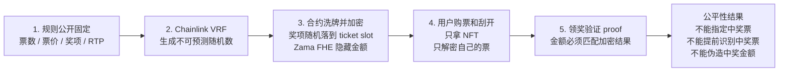

# LuckyScratch 公平与随机性流程图

图片版：

- [SVG 矢量图](./assets/luckyscratch-fairness-flow.svg)
- [PNG 图片](./assets/luckyscratch-fairness-flow.png)

Mermaid 源码：

```mermaid
flowchart LR
  rules["1. 规则公开固定<br/>票数 / 票价 / 奖项 / RTP"]
  vrf["2. Chainlink VRF<br/>生成不可预测随机数"]
  shuffle["3. 合约洗牌并加密<br/>奖项随机落到 ticket slot<br/>Zama FHE 隐藏金额"]
  play["4. 用户购票和刮开<br/>只拿 NFT<br/>只解密自己的票"]
  claim["5. 领奖验证 proof<br/>金额必须匹配加密结果"]
  result["公平性结果<br/>不能指定中奖票<br/>不能提前识别中奖票<br/>不能伪造中奖金额"]

  rules --> vrf --> shuffle --> play --> claim --> result
```